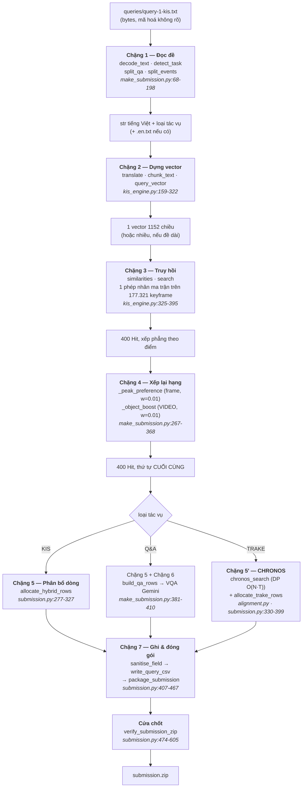

# Bản đồ kiến trúc — từ một câu hỏi tới một file zip

Tài liệu này để **đọc hiểu mã nguồn**, không phải để chạy. Muốn biết chạy lệnh gì
trong giờ thi thì đọc [CONTEST_RUNBOOK.md](CONTEST_RUNBOOK.md). Muốn biết chỗ nào
còn cải thiện được thì đọc [KIEN_TRUC_VA_HUONG_CAI_THIEN.md](KIEN_TRUC_VA_HUONG_CAI_THIEN.md).
Ở đây trả lời đúng một câu hỏi: *khi ta gõ một lệnh, dữ liệu đi qua những file nào,
biến đổi thành cái gì ở mỗi chặng, và vì sao chặng đó được viết như vậy.*

Mọi số dòng trong tài liệu này đều được đối chiếu với mã nguồn tại thời điểm viết.
Chỗ nào tôi không chắc, tôi ghi rõ là không chắc.

---

## 0. Đọc gì trước — 15 phút định hướng

Nếu bạn chỉ có 15 phút, đọc đúng bốn khối docstring này, theo thứ tự. Chúng chứa
gần như toàn bộ lý do thiết kế; phần còn lại của repo chỉ là hiện thực hoá.

| Thứ tự | File | Dòng | Nó nói gì |
|---|---|---|---|
| 1 | `src/core/submission.py` | 1–31 | Ba công thức chấm điểm của BTC, và **hai hệ quả** chi phối mọi quyết định trong repo |
| 2 | `src/core/kis_engine.py` | 1–24 | Vì sao bộ truy hồi lại gọn đến thế, và ba thứ đã thử rồi bỏ |
| 3 | `src/core/objects.py` | 1–27 | Cái bẫy "video R@1 tăng nhưng điểm thi giảm" — bài học đắt nhất của dự án |
| 4 | `scripts/make_submission.py` | 227–256 | `ranked_hits` — thứ hạng duy nhất mà mọi công cụ phải đồng ý |

Hai hệ quả ở mục 1, viết lại cho gọn vì tất cả các chặng phía dưới đều dựa vào chúng:

**(a) Dòng thừa là miễn phí.** `R@k` là **max trên k dòng đầu**, không phải tổng,
không phải trung bình (`r_at_k`, `src/core/submission.py:113-116`). Một dòng sai
về mặt toán học không thể kéo bất kỳ `R@k` nào xuống. Cái giá duy nhất của một
dòng thừa là chỗ hạng nó chiếm — mà hạng 51–100 vốn chẳng có gì để mất. Nên
**luôn nộp đủ 100 dòng**.

**(b) Chỉ số keyframe thường là thứ SAI để nộp.** `frame_id` trong luật là số
nguyên bất kỳ của video gốc, *không bắt buộc* phải là một keyframe đã trích.
Keyframe trong kho này cách nhau trung vị ~55 frame, còn cửa sổ đáp án thì dưới
10 frame. Nộp thuần chỉ số keyframe là tự chặn trần điểm dù truy hồi hoàn hảo
(`src/core/submission.py:22-30`).

Từ (a) và (b) sinh ra hai thứ mà người mới hay thấy khó hiểu: **thang frame**
(`frame_ladder`) và **bộ phân bổ 100 dòng** (`AllocationPlan`). Xem chặng 5.

---

## 1. Bản đồ đường chính

Đây là đường đi khi chạy `python scripts/make_submission.py --queries <thư mục> --out <thư mục>`.



Cùng thứ đó dưới dạng ASCII, kèm **kiểu dữ liệu** ở mỗi mũi tên — đây mới là thứ
đáng nhớ:

```
bytes                       queries/query-1-kis.txt
  │  decode_text()          make_submission.py:154
  ▼
str (tiếng Việt)
  │  translate() + read_en_override()
  ▼
(vi, en)
  │  encode_texts() × 4 prompt, trọng số 0.45/0.35/0.10/0.10
  ▼
np.ndarray (1152,)          đã L2-normalise
  │  embeddings @ vec       817 MB, mmap, chia lô 200.000
  ▼
np.ndarray (177321,)        điểm tương đồng của MỌI keyframe
  │  argpartition top-400 · mask self.valid
  ▼
List[Hit] × 400             Hit = (video_id, frame_idx, score, n, pts_time, video_last_frame)
  │  _peak_preference → _object_boost
  ▼
List[Hit] × 400             ĐÃ XẾP LẠI — đây là thứ tự đi vào CSV
  │  Candidate(...) → allocate_hybrid_rows(n_flat=30)
  ▼
List[(video_id, frame_id)]  đúng 100 phần tử
  │  sanitise_field → csv.writer(lineterminator="\n")
  ▼
csv/query-1-kis.csv         UTF-8 không BOM, LF, không header
  │  package_submission
  ▼
submission.zip              chứa thư mục "submission/" BÊN TRONG
  │  verify_submission_zip  → List[str] rỗng nghĩa là sạch
  ▼
upload
```

**Nguyên tắc xuyên suốt cần nắm trước khi đọc tiếp:** một tín hiệu chỉ được vào
đường chấm điểm sau khi đã đo trên 60 câu ground truth bằng công thức chính thức.
Chưa đo, hoặc đo ra âm, thì nó đi tới **mắt người** (`review.html`, các script
`search_*`), không đi tới bảng xếp hạng. Bảng tổng kết mọi phép đo nằm ở
`docs/KIEN_TRUC_VA_HUONG_CAI_THIEN.md` mục 2.

---

## 2. Chặng 0 — Dữ liệu nền

Trước khi có chặng nào, phải có chỉ mục. Kiểm chứng trực tiếp trên máy này:

| Thứ | Giá trị | Cách kiểm |
|---|---|---|
| Số keyframe | **177.321** | `len(json.load(open('data/metadata.json')))` |
| Số video | **873** | số `video_id` phân biệt |
| Kích thước vector | **1152** | `np.load(...).shape` |
| File embedding | `data/embeddings_siglip2_384.npy`, 817 MB (779 MiB), float32 | `ls -l` |
| Mô hình | `google/siglip2-so400m-patch14-384` | `kis_engine.py:36` |

Một dòng `metadata.json` trông như thế này:

```json
{"video_id": "L21_V001", "n": 1, "frame_filename": "001.jpg",
 "frame_idx": 0, "pts_time": 0.0, "fps": 30.0, "rel_path": "L21_V001/001.jpg"}
```

Hai trường dễ nhầm và bạn sẽ gặp lại chúng ở khắp nơi:

- **`n`** là *số thứ tự keyframe trong video* (1, 2, 3…). Nó là thứ dùng để dựng
  tên file ảnh và tải ảnh từ CDN.
- **`frame_idx`** là *chỉ số frame trong video gốc*. Nó là thứ **nộp cho BTC**.

Nhầm hai cái này là một lớp lỗi riêng. Ví dụ cụ thể trong mã: bộ trả lời Q&A được
đưa các đối tượng `Hit` chứ không phải các dòng thang, vì `fetch_single_image` khoá
theo `n`, còn `frame_id` của một dòng thang là **số nguyên tổng hợp không tương ứng
với keyframe nào** (`make_submission.py:390-393`).

`KISEngine.load()` (`kis_engine.py:77-120`) nạp chỉ mục bằng `mmap` và dựng sẵn:

- `self.video_id`, `self.frame_idx`, `self.n_in_video`, `self.pts_time` — mảng NumPy song song với `metadata`
- `self.last_frame: Dict[str, int]` — frame cuối của mỗi video, để thang frame không tràn ra ngoài
- `self.valid` — mặt nạ boolean: bỏ `skip_first_n=2` keyframe đầu mỗi video (thường là bumper kênh hoặc frame đen, `kis_engine.py:65-67`) và bỏ các frame trắng liệt kê trong `data/blank_frame_indices.json`

Nếu số dòng metadata lệch số vector, `load()` ném `ValueError` ngay
(`kis_engine.py:90-94`) — sinh lại embeddings thì phải sinh lại metadata cùng lúc.

---

## 3. Chặng 1 — Đọc đề

**File chịu trách nhiệm:** `scripts/make_submission.py` dòng 68–224.

Chặng này trông tầm thường nhưng đã sinh ra vài lỗi mất trắng câu, nên nó được viết
rất phòng thủ.

### `decode_text` (dòng 154–183) — chấm điểm cách giải mã, không thử tuần tự

Cách ngây thơ là thử `utf-8`, rồi `utf-16`, rồi `cp1258`, lấy cái đầu tiên không ném
lỗi. Cách đó **hỏng âm thầm**: codec `utf-16` của Python chấp nhận gần như *mọi*
chuỗi byte độ dài chẵn (không BOM thì giả định little-endian, chỉ từ chối surrogate
lẻ). Nên một file cp1258 sẽ giải mã ra chữ Hán, nhánh cp1258 không bao giờ tới lượt,
và câu hỏi đi truy hồi trên rác — 0 điểm mà không có lỗi nào ở đâu cả.

Nên mọi cách giải mã đều được **chấm điểm** rồi lấy cái "trông giống tiếng Việt nhất":

```python
score = (
    sum(low.count(c) for c in _VN_MARKS) * 3          # dấu tiếng Việt: ×3
    + sum(ch.isascii() and (ch.isalnum() or ch.isspace()) for ch in s)
    - sum(ord(ch) > 0x2000 for ch in s) * 5           # khối CJK/lạ: phạt nặng
)
```

`read_query_text` (137) và `read_en_override` (204) đều đi qua đây. `utf-8-sig` đứng
đầu danh sách để BOM bị *bỏ* chứ không dính vào đầu prompt.

### `detect_task` (dòng 68–74)

Suy loại tác vụ từ **tên file**, theo đúng quy ước BTC đặt:

```
query-1-kis.txt    → kis    → "video_id,frame_id"
query-2-qa.txt     → qa     → "video_id,frame_id,answer"
query-3-trake.txt  → trake  → "video_id,frame_1,...,frame_n"
```

Không khớp gì thì mặc định là `kis` — an toàn, vì dòng KIS là **tiền tố** của hai
định dạng kia.

> ⚠️ `detect_task` chỉ kiểm tra chuỗi con, nên *bất kỳ* tên file nào chứa "qa" cũng
> thành Q&A. Trong khi đó bộ kiểm tra bài nộp dùng regex chặt hơn có ranh giới từ
> (`submission.py:470-471`). Hai chỗ này có thể bất đồng với một tên file lạ — giữ
> nguyên tên BTC đặt.

### `split_events` (dòng 77–134) — chỗ dễ mất cả câu nhất

**Số sự kiện tách ra CHÍNH LÀ số cột CSV**, và bộ chấm so cột `j` với cửa sổ `j`.
Đếm sai không phải là mất một sự kiện — là **0 điểm cả câu**.

Bốn nhánh, theo thứ tự tường minh giảm dần:

1. `E1: ... E2: ...` — marker có dấu câu (dòng 96)
2. `E1 ... E2 ...` — marker **không** dấu câu, neo vào đầu dòng (dòng 111)
3. `(1) ... (2) ...` — danh sách đánh số, đúng phrasing mà luật dùng (dòng 116)
4. `bối cảnh: a; b; c` — danh sách sau dấu hai chấm (dòng 127)

Nhánh 2 tồn tại vì **vòng 1 viết đúng kiểu đó**. Thiếu nó thì prompt rơi xuống
fallback theo dòng, dòng dẫn chuyện đầu tiên bị tính thành sự kiện thứ tư, ghi 5 cột
trong khi đáp án có 4 (chú thích tại dòng 106–110).

Phần thân chung được **ghép vào trước mỗi sự kiện**, vì "giậm nhảy" đứng một mình
không truy hồi được gì, còn "vận động viên nhảy cao, giậm nhảy" thì ra đúng cảnh
(dòng 90–92).

### `split_qa` (dòng 186–198)

Câu hỏi là mệnh đề cuối kết thúc bằng `?`; mọi thứ trước đó là **bối cảnh để truy
hồi**. Truy hồi chạy trên bối cảnh, VQA chạy trên câu hỏi. Tách hỏng thì rơi về dùng
cả đoạn — truy hồi vẫn chạy.

### `read_en_override` (dòng 204–224) — bản dịch tay

Đặt file cùng tên, đuôi `.en.txt`, cạnh file đề:

```
round1/queries/query-1-kis.txt      ← đề gốc BTC
round1/queries/query-1-kis.en.txt   ← bản tiếng Anh viết tay
```

Đáng khoảng 8 điểm phần trăm video R@1, và dịch tự động là endpoint bị rate-limit
đúng lúc tải cao — tức đúng lúc vòng thi đang chạy. Một thành viên gõ bản dịch trong
ba tiếng là phương án dự phòng thật, không phải chắp vá.

`main()` lọc `.en.txt` / `.vi.txt` khỏi danh sách query (dòng 499–501), nếu không
chúng sẽ sinh CSV thừa trong zip.

---

## 4. Chặng 2 — Dựng vector truy vấn

**File chịu trách nhiệm:** `src/core/kis_engine.py` dòng 159–322.

### Dịch VI → EN (dòng 159–251)

SigLIP-2 đa ngữ nhưng corpus caption nó học là tiếng Anh. Đo được: video R@1 đi từ
35,0% lên 43,3% khi cho nó bản tiếng Anh thật (docstring dòng 163–166).

Ba lớp dự phòng, theo thứ tự **Gemini → Google free → MyMemory** (dòng 213–251).
Gemini đứng đầu vì nó là API có xác thực; endpoint Google mà `deep_translator` cào
rate-limit nặng và trả `TranslationNotFound` đúng lúc tải cao.

Cache ra `data/translation_cache.json`. Dịch hỏng thì **trả lại nguyên văn tiếng
Việt và in cảnh báo một lần**, không bao giờ ném lỗi (dòng 194–202).

### `chunk_text` (dòng 253–302) — cắt đoạn thay vì để bị cắt cụt

Text tower của SigLIP-2 nhận **64 token** và âm thầm bỏ phần dư. Đo trên vòng 1:
**13 trên 24 câu vượt quá giới hạn đó** (dòng 258–259).

Và thứ rơi ra ngoài chính là chi tiết phân biệt, vì người tả cảnh trước, đặc điểm
nhận dạng sau: *"…người chạy thứ hai đội mũ đỏ"*, *"…loài chim này thường gặp ở miền
Nam"*.

Nên: ghép câu tham lam sao cho mỗi đoạn ≤ 58 token, câu nào vẫn quá dài thì cắt tiếp
theo dấu phẩy.

### `query_vector` (dòng 304–322) — bộ 4 prompt

```python
prompts = [
    en,                                              # 0.45
    vi,                                              # 0.35
    f"a high quality video keyframe of {en}",        # 0.10
    f"a photo of {en}",                              # 0.10
]
v = (encode_texts(prompts) * PROMPT_WEIGHTS).sum(axis=0)
return v / norm(v)
```

Trọng số ở `PROMPT_WEIGHTS`, dòng 39. Hơn bản chỉ-tiếng-Anh **6,6 điểm video R@1**
trên 60 mẫu (docstring dòng 11–14).

Điểm quan trọng về kiến trúc: bản dịch máy và bản dịch tay **cùng nằm trong một
vector**, không phải hai danh sách ứng viên gộp lại. Lập luận cũ "R@k là max trên
tiền tố nên thêm ứng viên chỉ có lợi" là **sai**, vì gộp danh sách cũng *đảo thứ tự*
— và 30 chỗ đầu là hữu hạn. Đo trên 60 câu (`ranked_hits` docstring, dòng 238–246):

| Cách | Điểm |
|---|---|
| chỉ dịch máy | 0,292 |
| chỉ bản dịch tay | 0,321 |
| gộp hai danh sách (cũ) | 0,305 |
| **cả hai trong một vector (nay)** | **0,337** |

### `query_similarities` (dòng 334–362) — gộp các đoạn bằng TRUNG BÌNH

`combine="mean"` chứ không phải `"max"`. `mean` thưởng frame thoả **toàn bộ** mô tả;
`max` thưởng frame khớp *một mệnh đề bất kỳ* — đó là cách "một cái giá sách" thắng
chính cái cảnh mà mệnh đề đó thuộc về (dòng 344–346).

Chi tiết đáng chú ý: đoạn **đầu tiên** giữ cả nhánh tiếng Việt (nó mang bối cảnh),
các đoạn sau chỉ mã hoá tiếng Anh (dòng 355–360).

---

## 5. Chặng 3 — Truy hồi

**File chịu trách nhiệm:** `src/core/kis_engine.py` dòng 325–395.

Toàn bộ chặng này là **một phép nhân ma trận**:

```python
out[a:b] = np.asarray(self.embeddings[a:b], dtype=np.float32) @ vec   # dòng 331
```

Chia lô 200.000 vector để không nạp cả 817 MB vào RAM cùng lúc. Rồi
`argpartition` lấy top-`n`, `argsort` sắp phần nhỏ đó.

Ba quyết định thiết kế, cả ba đều là **bỏ đi một thứ mà bản retriever cũ có**
(docstring `kis_engine.py:15-23`):

| Bỏ đi | Vì sao |
|---|---|
| Giới hạn 2 frame/video, cách nhau ≥10 giây | Đó là tối ưu cho độ đo *cấp video*. Điểm chính thức cần một frame *rơi trong cửa sổ*, mà R@k là max — nên frame thêm của một video đã có trong danh sách là **bảo hiểm miễn phí**. Bỏ cap làm điểm tăng ở *mọi* độ rộng cửa sổ đã thử. |
| Làm mượt theo thời gian | Đã thử, làm điểm tệ đi |
| Chuẩn hoá điểm theo từng video | Đã thử, làm điểm tệ đi |

Hai cái sau được ghi vào docstring **để không ai thêm lại theo cảm tính**. Đó là một
mẫu lặp lại khắp repo: kết quả âm cũng được ghi lại, ngang với kết quả dương.

`RETRIEVE_TOP_N = 400` (`make_submission.py:62`) là **một hằng số duy nhất cho mọi
công cụ**, không cho từng bên tự chọn. Lý do ở chú thích ngay đó: điểm cộng đối tượng
là phép *max trên các ứng viên của mỗi video*, nên pool to hơn có thể tìm ra khớp
mạnh hơn và **xếp lại thứ tự video khác đi**. Khi `make_submission` dùng 200 còn
trang duyệt dùng 400, trang hiển thị video hạng 1 khác với video trong chính CSV mà
nó đang minh hoạ.

---

## 6. Chặng 4 — Xếp lại hạng

**File chịu trách nhiệm:** `scripts/make_submission.py` dòng 227–368.

### `ranked_hits` — API duy nhất được phép gọi

```python
def ranked_hits(engine, query_text, query_en, top_n=RETRIEVE_TOP_N):
    hits = engine.search(...)
    hits = _peak_preference(engine, hits)
    return _object_boost(engine, hits, query_en or engine.translate(query_text))
```

Đây là quy tắc cứng nhất của repo: **không công cụ vận hành nào được gọi
`engine.search()` trực tiếp.** `engine.search` chỉ trả thứ hạng thô của embedding;
`ranked_hits` mới là thứ hạng thật.

Vì sao nó quan trọng đến mức có test canh: trước đây `make_submission` xếp hạng bằng
một hàm, `review.html` bằng hàm thứ hai, `apply_picks` bằng hàm thứ ba. Ngay khi có
một file `.en.txt` — đúng thứ runbook bảo cả nhóm viết — ba thứ hạng đó khác nhau,
nên **người soát duyệt một khung hình không phải khung hình ở dòng 1 của bài nộp**.
Hỏng kiểu này im lặng tuyệt đối, và nó phá đúng cái phán đoán của con người mà cả
vòng lặp sinh ra để thu thập.

`tests/test_review_workflow.py:95-128` đọc *mã nguồn* của 7 script vận hành, bắt buộc
mỗi file phải chứa chuỗi `ranked_hits`, và fail nếu tìm thấy bất kỳ lời gọi
`eng.search(` / `engine.search(` nào ngoài comment.

> `merged_hits` (dòng 259) chỉ là **alias** của `ranked_hits`, giữ lại để không vỡ
> giữa vòng thi. Nó **không còn gộp danh sách nữa** — đừng suy ra hành vi từ cái tên.

### `_peak_preference` (dòng 267–324) — ưu tiên đỉnh cục bộ, w = 0,01

Ý tưởng một câu: **khoảnh khắc là một đỉnh, còn cảnh là một cao nguyên.** Các frame
hai bên là cùng cảnh đó sớm/muộn một giây và điểm gần bằng nhau, nên thứ tự nội bộ
trong một video gần như ngẫu nhiên.

Đo được: keyframe *gần đáp án nhất* chỉ đứng hạng 1 trong đúng video **48%** số lần,
nhưng nằm trong top-5 của video đó tới **76%** (dòng 273–275).

Vì sao vài bậc lại đáng giá đến thế — đây là chỗ chặng 4 nối vào chặng 5: ngân sách
dòng chi theo `cost(i, d) = i + 0,5·d`, nên ứng viên hạng 1 được thang vươn tới
**±120 frame**, còn ứng viên hạng 25 chỉ được **một dòng phẳng không thang** (dòng
277–281). Đẩy đúng keyframe lên vài bậc là đưa nó tới chỗ đã sẵn có thang sâu.

Chỉ xét hàng xóm **đã nằm trong danh sách ứng viên**; hàng xóm điểm quá thấp không
được lấy thì frame đó mặc nhiên là đỉnh.

### `_object_boost` (dòng 333–368) → `src/core/objects.py`

BTC ship sẵn nhãn nhận dạng OpenImages cho từng keyframe. Nước đi hiển nhiên là cộng
điểm cho frame nào có nhãn khớp câu hỏi. **Đo được, nước đi đó vô dụng hoặc có hại.**

Bảng đo (60 câu, công thức chính thức, đáp án không snap, 64 lần rút thăm, cửa sổ
6/10/20/40 — `src/core/objects.py:8-16`):

| Cách cộng | Điểm | video R@1 |
|---|---|---|
| không dùng | 0,374 | 26/60 |
| theo **frame**, trọng số tốt nhất | 0,375 (+0,4%, nhiễu) | 27/60 |
| khớp **số lượng** ("ba người"), mọi trọng số | 0,374 (**±0,0%**, trơ hoàn toàn) | 26/60 |
| theo frame, trọng số 0,05 | 0,346 (−7,4%) | 24/60 |
| **theo VIDEO, trọng số 0,01** | **0,386 (+3,3%)** | 26/60 |

Chỗ tách biệt đó **chính là cái bẫy đã tạo ra điểm 5,8 ban đầu của dự án**: bản
per-frame kéo video R@1 từ 26 lên 30 **trong khi làm điểm thi giảm**. Vì frame chứa
đúng vật thể không phải frame gần khoảnh khắc đáp án nhất — đẩy nó lên là đá văng
một frame cùng video vốn gần sự thật hơn.

Nên `ObjectIndex.rerank` (`objects.py:161-205`) tính bonus **một lần cho mỗi video**
(max trên các frame ứng viên của nó) rồi cộng đều cho mọi frame. Sắp xếp *ổn định
theo vị trí gốc*, nên thứ tự frame **bên trong** mỗi video giữ y nguyên như embedding
đã cho — vì đó mới là thứ tự biết về thời điểm (dòng 202–204).

Một chi tiết nhỏ nhưng đắt: bonus được **ghi lại vào trường `score`**, không chỉ dùng
để sắp xếp (dòng 190–195). Bản trước chỉ đảo thứ tự mà giữ điểm cũ, nên biên độ giữa
hạng 1 và video tốt nhì ra **số âm** trên ba câu vòng 1, và cờ "cần người xem" im
lặng ngừng bật đúng trên những câu mà bonus vừa đổi ý.

> Cả hai bước "làm đẹp" này đều **nuốt exception và trả về danh sách gốc**
> (dòng 322–324 và 365–368). Một bước phá hoà hay một điểm cộng phụ không bao giờ
> được phép làm hỏng lượt chạy.

> ⚠️ `_OBJECTS` và `USE_OBJECTS` là **biến toàn cục mức module** (dòng 328–330). Khi
> bạn `from scripts.make_submission import ranked_hits` trong script khác, điểm cộng
> đối tượng **mặc định BẬT**. Muốn tắt thì phải tự đặt `make_submission.USE_OBJECTS = False`.

---

## 7. Chặng 5 — Phân bổ 100 dòng (KIS và Q&A)

**File chịu trách nhiệm:** `src/core/submission.py` dòng 161–327.

Đây là hệ thống con dễ hiểu sai nhất, nên tôi tách nhỏ.

### Bài toán

Ta có 400 ứng viên đã xếp hạng và **đúng 100 chỗ**. Mỗi dòng nộp thực chất là một cặp:

- `i` = *ứng viên thứ mấy* (đi rộng — thêm video/keyframe khác)
- `d` = *nấc thang thứ mấy* (đi sâu — thêm frame id quanh cùng một keyframe)

Toàn bộ bài toán quy về: **đi ra xa theo chiều nào trước?**

### `frame_ladder` (dòng 161–192) — thang frame

Sinh các số nguyên quanh một tâm, **sắp theo khoảng cách tăng dần**:

```python
frame_ladder(1000, 5, step=10) == [1000, 990, 1010, 980, 1020]
```

Hai chi tiết đều load-bearing:

- **Vì sao sắp theo khoảng cách chứ không theo giá trị tăng dần:** ngân sách hạng
  luôn bị cắt cụt ở đâu đó. Sắp theo khoảng cách bảo đảm cắt ở *bất kỳ* chỗ nào cũng
  giữ lại đúng những id khả dĩ nhất, thay vì giữ toàn nửa bên trái.
- **Vì sao `step` mặc định = 10** (`ASSUMED_WINDOW_FRAMES`, dòng 52): nếu step lớn
  hơn bề rộng cửa sổ thì thang chừa ra những khe mà cửa sổ đáp án có thể lọt trọn vào
  giữa hai nấc. Với step bằng bề rộng cửa sổ, mọi cửa sổ rộng ít nhất bấy nhiêu nằm
  trong tầm thang đều **chắc chắn** chứa một id ta đã nộp.
  `tests/test_submission.py:117` quét mọi cửa sổ rộng `step+1` trong tầm thang và đòi
  cửa sổ nào cũng phải trúng.

Có kẹp biên `lo`/`hi` để thang không tràn ra ngoài độ dài video — đó là lý do
`Candidate` mang theo `video_last_frame`.

### `AllocationPlan` (dòng 211–236) — cái núm duy nhất

```python
cost(i, d) = breadth_cost * i + depth_cost * d
```

Bốn câu hỏi, bốn câu trả lời:

**(1) Vì sao cần một công thức chi phí?** Để biến hai chiều `(i, d)` thành **một thứ
tự duy nhất**. Sắp một lần rồi lấy dần cho tới khi đủ 100 — không cần luật `if/else`
nào.

**(2) Vì sao TUYẾN TÍNH?** Vì nó đơn điệu theo cả `i` lẫn `d`, nên:
- ô `(0,0)` luôn rẻ nhất → keyframe tốt nhất **luôn** chiếm hạng 1, chỗ duy nhất
  đáng trọn 1,0;
- trong cùng một ứng viên, các nấc thang luôn ra theo đúng thứ tự gần-trước-xa-sau.

Quét theo chi phí tăng dần chính là **quét chéo trên lưới `(i, d)`**: ứng viên đầu
bảng được thang sâu, ứng viên hạng thấp chỉ được một dòng phẳng.

**(3) Vì sao chiều sâu RẺ HƠN chiều rộng (0,5 < 1,0)?** Vì hai loại sai lệch không
đối xứng:
- **Sai video là chết hẳn.** `r_score_kis` trả 0 ngay tại dòng 62–63, không thang nào
  cứu được.
- **Đúng video mà frame lệch thì cứu được** — và trường hợp này phổ biến hơn cảm giác
  rất nhiều, đúng vì lý do ở mục 0(b): keyframe cách nhau ~55 frame, cửa sổ chỉ ~10.

Đặt `depth_cost = 0,5` nghĩa là *"hai id frame nữa cho ứng viên hiện tại đắt bằng một
video mới"* — trả lời trực tiếp câu hỏi "đổi bao nhiêu frame lấy một video".

**(4) Vì sao đúng 0,5?** Không phải trực giác — **quét thực nghiệm** bằng
`scripts/experiment_allocation.py`.

> ⚠️ **Giá trị mặc định trong dataclass KHÔNG phải giá trị đang chạy.**
> `AllocationPlan.depth_cost` mặc định là **0.75** (dòng 232), nhưng cấu hình nộp
> thật là **0.5** (`DEFAULT_DEPTH_COST`, `make_submission.py:54`). Tương tự
> `allocate_hybrid_rows` mặc định `n_flat=20` (dòng 279) trong khi bản chạy thật dùng
> **30** (`DEFAULT_N_FLAT`, dòng 53).
> Viết `AllocationPlan()` trần trong một script thí nghiệm là bạn đang đo **một cấu
> hình khác** với cấu hình đã nộp. Luôn viết rõ
> `AllocationPlan(breadth_cost=1.0, depth_cost=0.5, step=10)`.

> ⚠️ Docstring của `AllocationPlan` (dòng 228) trỏ tới `scripts/tune_allocation.py`.
> **File đó không tồn tại.** Bộ quét thật là `scripts/experiment_allocation.py`.

### `allocate_hybrid_rows` (dòng 277–327) — chiến lược ĐANG DÙNG

Hai pha:

```
dòng 1..30    : 30 keyframe KHÁC NHAU, mỗi ứng viên đúng một dòng  (pha "phẳng")
dòng 31..100  : gọi allocate_kis_rows để rải thang theo cost(i,d)  (pha "thang")
```

Vì sao lai: **BTC không bao giờ công bố cửa sổ `[s,e]` rộng bao nhiêu**, và chiến
lược tối ưu *đảo chiều* theo bề rộng đó:

- cửa sổ **rộng** (cả một cảnh) → tiêu mọi dòng cho keyframe khác nhau là tốt nhất;
- cửa sổ **hẹp** (ví dụ 11 frame của luật) → keyframe gần như vô dụng, phải rải thang.

Vì `R@k` là max trên **tiền tố**, hai chiến lược ghép lại gần như miễn phí: giao các
hạng đắt (1 · 2–5 · 6–20, đáng 1,0 · 0,8 · 0,6) cho keyframe riêng biệt, còn phần
đuôi rẻ (21–100, chỉ đáng 0,4 và 0,2) cho thang. Cửa sổ rộng thì điểm bằng đúng chiến
lược thuần keyframe; cửa sổ hẹp thì vẫn có điểm thay vì trắng tay.

Đo trên 60 mẫu qua các bề rộng cửa sổ từ 10 đến 200 frame: **thắng chiến lược
thuần-keyframe ở MỌI bề rộng đã thử**, không phải chỉ thắng trung bình
(`make_submission.py:50-52`). `scripts/experiment_strategies.py` xếp hạng các chiến
lược theo **trường hợp xấu nhất** trên dải bề rộng khả dĩ, không theo trung bình.

### Một cái bẫy đo lường phải biết

**Đừng bao giờ chấm điểm bộ phân bổ bằng `data/ground_truth.json` thô.**

93% (56/60) frame đáp án trong file đó **trùng khít một keyframe của chỉ mục**, vì nó
được tạo bằng cách chọn keyframe từ chính chỉ mục này. Đáp án thật của BTC là một
khoảnh khắc người ta đánh dấu trong video gốc, rơi bất kỳ đâu trong khe ~60 frame.

Hậu quả, đo được (`docs/WHAT_CHANGED.md:140-152`):

| Cấu hình | GT thô (đã snap) | GT rút thăm lại (24 lần) |
|---|---|---|
| `n_flat=100` (thuần keyframe) | **0,562** ← "tốt nhất" | 0,257 |
| `n_flat=30` (đang dùng) | 0,526 | **0,333** ← thật sự tốt nhất |

Kết luận **đảo ngược hoàn toàn**. Đây đúng là loại sai số đã tạo ra "Top-1 41,67%"
trên máy mà chỉ 5,8 trên bảng xếp hạng. `experiment_allocation.py` mặc định chạy bản
đã sửa thiên vị; cờ `--snapped` chỉ để **tái hiện cái bẫy**, không phải để dùng.

Quét lại quanh đỉnh với 24 lần rút thăm: cấu hình đang chạy (30 / 0.5 / 10) đạt 0,333
so với 0,338 của cấu hình tốt nhất tìm được (28 / 1.0 / 14). Chênh 1,5%, nằm trong
nhiễu → **không đổi**. Hướng tinh chỉnh phân bổ đã cạn.

---

## 8. Chặng 5' — TRAKE

**File chịu trách nhiệm:** `src/task3_trake/` (đường chạy thật: `trake_engine.py` →
`alignment.py`), rồi `src/core/submission.py:330-399`.

### Luật quyết định thiết kế

```
R-Score = 0                                      nếu sai video
        = (1/N) · Σ_j I(frame_j ∈ [s_j, e_j])    nếu đúng video
```

Video là **được-ăn-cả-ngã-về-không**, còn các sự kiện được chấm **điểm từng phần**.
Hai hệ quả trực tiếp (`trake_engine.py:16-22`):

1. Chỉ **MỘT** video đáng nộp — mọi dòng dùng cùng video đó, vì dòng trên video khác
   ăn 0 tuyệt đối.
2. Ngân sách tiêu vào **nhiễu loạn bộ frame**, vì cửa sổ 10 frame với keyframe cách
   nhau ~55 nghĩa là chỉ số keyframe thô thường trượt *kể cả khi căn chỉnh đúng*.

### Bốn tầng (theo spec nội bộ)

| Tầng | Tên | File | Việc |
|---|---|---|---|
| L1 | EDL | `decomposer.py` | câu hỏi tiếng Việt → danh sách sự kiện có thứ tự |
| L2 | MCS | `scoring.py` | hợp nhất kênh → ma trận điểm `(N sự kiện × T keyframe)`, z-score **theo hàng** |
| L3 | TAP | `alignment.py` | quy hoạch động CHRONOS chọn dãy tăng dần, rồi quét cả kho |
| L4 | VVR | `verifier.py` | VLM chấm lại top-k |

> ⚠️ **Trên đường chạy thật, L4 không được gọi.** `verifier.py` chỉ được nối vào
> `chronos_engine.py`, mà `chronos_engine.TrakeEngine` chỉ có **test** gọi tới (kiểm
> bằng grep toàn repo). Đường sản phẩm là `trake_engine.TRAKEEngine`, được
> `src/task3_trake/__init__.py` export và `make_submission.py:421` import. **Hai class
> tên gần giống nhau — đừng đọc nhầm file.**

### L2 trên thực tế: chỉ có kênh hình ảnh

`scoring.py` cài đủ 4 chế độ trộn kênh (`SCORING_MODES`, dòng 34–39):

```python
"visual":     {"visual": 1.00, "ocr": 0.00, "asr": 0.00}
"balanced":   {"visual": 0.70, "ocr": 0.15, "asr": 0.15}
"text_heavy": {"visual": 0.40, "ocr": 0.40, "asr": 0.20}
"speech":     {"visual": 0.50, "ocr": 0.10, "asr": 0.40}
```

Nhưng `TRAKEEngine._score_matrix` gọi `fuse(..., mode="visual")`
(`trake_engine.py:103`) — tức **beta = gamma = 0**. Ba kênh trong docstring là năng
lực có sẵn, không phải cấu hình đang chạy.

Vì sao z-score **theo từng hàng** là bắt buộc: các sự kiện có "độ khó" khác nhau
(khái niệm quen thuộc được điểm cosine cao đều đặn). Không chuẩn hoá thì DP sẽ **hy
sinh sự kiện khó để tối ưu sự kiện dễ** (`scoring.py:6-10`).

Và một chi tiết đã từng phá hỏng cả ma trận: mặt nạ frame bị loại được áp **SAU** khi
fuse, không phải trước (`trake_engine.py:93-105`). Masking trước z-score không chỉ
sai mà là *thảm hoạ*: vài nghìn ô `-1e4` sẽ chi phối mean/std và ép mọi độ tương đồng
thật vào một dải mỏng dính quanh 0 — DP sẽ không thấy tín hiệu nào cả.

### L3: hạt nhân CHRONOS

Bài toán: cho ma trận `S` `(N, T)`, chọn trong dải `[s_v, e_v]` của **một** video các
chỉ số `t_1 < t_2 < … < t_N` (cách nhau tối thiểu `g`) sao cho tối đa hoá tổng điểm
trừ hình phạt giãn cách.

Đệ quy (`alignment.py:10-17`):

```
DP[1, t] = S[1, t] − mu · (t − s_v)/(e_v − s_v)
DP[i, t] = S[i, t] + max_{τ ≤ t−g} ( DP[i−1, τ] − lambda·(t − τ) )
```

Mẹo làm nó thành **O(N·T)**: `−lambda·(t−τ)` tách được thành `−lambda·t + lambda·τ`,
nên một *running maximum* trên `DP[i−1, τ] + lambda·τ` là đủ.

Có **hai bản cài đặt**, và đó là cố ý:

- `chronos_align_ref` (dòng 97) — viết bằng vòng lặp, làm chân lý đối chiếu
- `chronos_align` (dòng 171) — vector hoá bằng `np.maximum.accumulate`

Test fuzz trong `src/task3_trake/tests/test_alignment.py` đòi hai bản **trùng khít**
trên mọi ma trận ngẫu nhiên có/không mask. Đó là lý do docstring nói rõ vì sao dùng
so sánh `>` chính xác thay vì `> ... + 1e-9` như spec viết: một biên epsilon *không
thể* làm cho hai bản đồng ý với nhau (dòng 26–41).

Hai tham số đáng biết:

- **`lambda`** — hình phạt giãn cách, suy ra từ nhịp sự kiện bởi `adaptive_lambda`
  (dòng 357). Chi tiết quan trọng: nó được **nhân với `score_scale(S)`**, vì hằng số
  trong spec được hiệu chỉnh trên cosine thô còn DP ăn ma trận đã z-score theo hàng —
  lớn hơn khoảng một bậc. Không nhân thì "adaptive" thành *trơ*: benchmark nội bộ cho
  lambda ≈ 0,0006 và 70% Sequence Accuracy, so với 84% của lambda cố định 0,01. Tức
  cơ chế "thích ứng" khi đó **có hại** (dòng 373–382).
- **`mu`** — tiên nghiệm "khoảnh khắc đầu tiên". `align_sequence` đặt `mu = 2.0` khi
  đề có chữ *"đầu tiên"* / *"lần đầu"* / *"first"* (`trake_engine.py:130`,
  `make_submission.py:449`).

`chronos_search` (dòng 645) quét **mọi** video trong kho rồi trả top-k. Bốn chế độ
căn chỉnh (`ordered` / `strict_window` / `unordered` / `soft_order`) đều đã cài; đường
chạy thật dùng `ordered` (mặc định).

Vì sao dùng DP thay vì lấy top-1 độc lập từng sự kiện rồi sắp xếp: trên benchmark có
ground truth cấy sẵn, bản top-1-độc-lập đạt **20%** sequence accuracy, CHRONOS đạt
**88%** (`trake_engine.py:24-28`). Maxima độc lập bỏ qua cả ràng buộc thứ tự lẫn việc
các sự kiện thuộc về một hành động liên tục.

### `allocate_trake_rows` (`submission.py:330-399`)

Đầu vào là **một** video và `N` frame. 100 dòng tiêu vào việc nhiễu loạn bộ frame đó.

Hai quyết định:

**Bán kính `reach` tự nới ra** cho tới khi lưới đủ lớn lấp hết ngân sách (dòng
357–360):

```python
reach = 2
while (2 * reach + 1) ** n < budget and reach < budget:
    reach += 1
```

Bảng chữ cái offset cố định 5 giá trị chỉ cho `5**n` tổ hợp — tức 5 dòng với câu 1 sự
kiện và 25 dòng với câu 2 sự kiện, vứt đi phần lớn 100 chỗ hạng miễn phí đúng vào
những câu mà frame khó trúng nhất.

**Duyệt lưới bằng heap tốt-nhất-trước**, không liệt kê hết tích Descartes rồi sắp
(dòng 362–366). Hai lý do:
1. Bùng nổ: `25**6` tổ hợp cho câu 6 sự kiện.
2. Tinh vi hơn — liệt kê rồi cắt cụt theo chiều sâu sẽ **đóng băng các toạ độ đầu**,
   nên những sự kiện đầu tiên không bao giờ được nhiễu loạn. Heap theo *tổng độ dịch
   tuyệt đối* cho mọi sự kiện cơ hội ngang nhau.

### Trần cứng của TRAKE

`docs/CHAN_DOAN_TRAKE.md` đo ra ba giới hạn đã định lượng, tóm lại trong
`KIEN_TRUC_VA_HUONG_CAI_THIEN.md` mục 3: với câu 4 sự kiện, lưới bù trừ cần 625 tổ
hợp mà chỉ có 100 dòng → phủ 16%. **Kể cả mô hình hoàn hảo cũng chỉ đạt ~0,45 trên
nhóm video múa lân** (keyframe ở đó cách nhau 92 frame). Biết trần này trước khi bỏ
công tối ưu TRAKE.

---

## 9. Chặng 6 — Đáp án Q&A

**File chịu trách nhiệm:** `make_submission.py:381-410` và `596-645`;
`src/core/gemini_engine.py`.

Q&A dùng **đúng bộ frame như KIS** (truy hồi trên phần *bối cảnh* của đề), rồi điền
**cùng một chuỗi đáp án lên MỌI dòng**.

Vì sao không để trống các dòng sau: luật 2.1.2 chấm 0 cho dòng có đáp án rỗng *bất kể
frame tốt đến đâu*. Bỏ trống (hoặc điền "Không xác định") là vứt luôn R@20/R@50/R@100
— **ba trong năm số hạng của Final Score** — mà chẳng đổi lại gì, vì một dòng chỉ ăn
điểm khi frame của nó đúng, còn một dòng sai thì không tốn gì.

Bộ trả lời (`_make_answerer`, dòng 596) lấy **5 hit đầu**, hỏi Gemini từng frame một,
rồi lấy **đáp án đa số** (`Counter.most_common`, dòng 643) — đáp án mà các frame đầu
đồng ý thắng đáp án của riêng frame hạng 1.

Nó được đưa các đối tượng `Hit`, **không phải** các dòng thang, vì `fetch_single_image`
khoá theo `n` (số thứ tự keyframe) chứ không theo `frame_idx`.

Không có key thì in cảnh báo to và trả `None` — thà thấy ngay còn hơn phát hiện trên
bảng xếp hạng (dòng 599–601).

> Quan sát về độ phân giải ảnh: có **ba** con số khác nhau trên ba đường đi.
> `gemini_engine.fetch_single_image` mặc định `max_dim=320` (dòng 56);
> `VLMJudge._fetch` hạ về **512px** (`vlm.py:63`); `read_answer.py` gửi tới **1536px**
> để đọc chữ nhỏ. Tách bước **ĐỌC** (chữ trên biển báo, mặt cân) khỏi bước **CHẤM**
> ("đây có phải cảnh đó không") là cố ý — 512px đúng cho câu hỏi thứ hai và sai cho
> câu hỏi thứ nhất.

---

## 10. Chặng 7 — Ghi CSV, đóng gói, và cửa chốt

**File chịu trách nhiệm:** `src/core/submission.py` dòng 407–605.

### `sanitise_field` (dòng 416–431) — xoá dấu phẩy, không escape

Đây là chỗ dễ tưởng là bug nhất trong repo, nên đọc kỹ.

`csv.writer` sẽ bọc một trường chứa dấu phẩy trong dấu nháy kép — **hoàn toàn đúng
RFC 4180**. Nhưng một bộ chấm tách chuỗi bằng `split(',')` sẽ thấy bốn trường với một
dấu nháy dính vào, và đáp án bị chấm sai. Đọc lại bằng `split(',')[2]` thì cắt cụt
lần thứ hai.

Đề vòng 1 hỏi những câu kiểu *"Hai câu thơ đó là gì?"* — không ai viết hai câu thơ mà
không có dấu phẩy.

Ta chọn **an toàn với bộ chấm ngây thơ** hơn là đúng chuẩn. Hệ quả bạn phải biết:
**đáp án Q&A của bạn sẽ mất dấu phẩy trong file nộp.** Đừng ngạc nhiên khi mở CSV ra
thấy khác chuỗi bạn gõ.

Và việc làm sạch đặt **TẠI ĐÂY**, điểm duy nhất mọi CSV đi qua, chứ không ở từng nơi
gọi — vì đó là một lỗi đã thật sự xảy ra: `make_submission` có strip dấu phẩy nhưng
hai đường thao tác tay (`apply_picks`, `pin_video`) thì không, nên cùng một đáp án an
toàn khi pipeline ghi ra mà **hỏng khi người sửa lại** (dòng 426–429).

### `write_query_csv` (dòng 434–447)

UTF-8 **không BOM**, phân cách phẩy, kết dòng **LF**, **không header**.
`newline=""` cộng `lineterminator="\n"` tường minh giữ file sạch CRLF trên Windows —
CRLF nguy hiểm âm thầm vì ký tự carriage return trở thành một phần của trường cuối.

`tests/test_submission.py:258-264` khẳng định byte ghi ra đúng bằng
`b"L01_V001,505\nL01_V001,515\n"`.

### `package_submission` (dòng 450–467)

Zip với thư mục tên đúng `submission/` **BÊN TRONG** archive. Zip các file CSV rời sẽ
bị từ chối — và một lần bị từ chối vẫn tiêu mất một trong **ba** lượt nộp của vòng.
Nên việc kiểm tra thuộc về **code**, không thuộc về checklist.

### `verify_submission_zip` (dòng 474–605) — cửa chốt cuối

Mở lại chính file zip sắp upload, đọc **TOÀN BỘ** chứ không lấy mẫu, trả về danh sách
vấn đề (rỗng = sạch). Nó kiểm cả những thứ BTC liệt kê lẫn những thứ **chết âm thầm**:

| Kiểm | Vì sao |
|---|---|
| Mọi entry nằm dưới `submission/` | Luật bắt buộc |
| Dòng header ở **bất kỳ** vị trí nào | Header giấu ở dòng 40 vẫn là header |
| BOM UTF-8 | Dán byte vô hình vào `video_id` đầu tiên |
| CRLF (`b"\r\n" in raw`) | Mọi kiểm tra bên dưới chạy trên `splitlines()`, hàm này **nuốt `\r`** trước khi có ai kịp nhận ra. Đã từng có file được tuyên bố "an toàn để nộp" trong khi mỗi đáp án đeo một `\r` ở đuôi |
| Dấu nháy kép | Nếu có nghĩa là có gì đó **đi vòng qua** `write_query_csv` |
| Đuôi `.mp4` trong video_id | Luật cấm |
| Quá 100 dòng | Luật cấm |
| Đáp án Q&A rỗng | Luật 2.1.2 chấm 0 |
| CSV **thiếu** (qua `expect_names`) | Một câu bị crash thì không sinh file nào mà archive vẫn *trông* hợp lệ |
| CSV **thừa** (qua `expect_names`) | File từ vòng trước nằm lại trong cùng thư mục `csv/` sẽ bị đóng gói theo |
| Số cột TRAKE không đồng nhất, hoặc chỉ có 2 cột | **Số cột chính là số sự kiện.** Sai kiểu này VÔ HÌNH vì mọi kiểm tra khác đều pass trên dòng 2 cột |

> ⚠️ Hàm này `break` ngay khi gặp dòng hỏng đầu tiên **trong một file** (dòng
> 589–596). Nghĩa là nó báo lỗi đầu tiên chứ không liệt kê hết. Sửa rồi chạy lại,
> đừng tưởng lần đầu đã thấy hết vấn đề.

Có **ba đường vào** cùng bộ kiểm tra này, và đó là chủ ý:

- `make_submission.py` tự gọi ở cuối (dòng 574)
- `scripts/verify_zip.py` — soi **bất kỳ** zip nào, kể cả zip do `review.html` tự dựng
  trong trình duyệt; không cần nạp chỉ mục 780 MB nên trả lời dưới một giây
- `scripts/repackage.py` — dùng sau khi sửa CSV bằng tay: đóng gói lại **RỒI** kiểm
  lại, không bao giờ bỏ bước kiểm

---

## 11. Vòng lặp người — nơi điểm thật sự đến từ

Ba chặng trên là "máy chạy một lượt". Nhưng runbook nói thẳng: soát bằng mắt là
**nguồn điểm lớn nhất trong ba tiếng thi**, vì đẩy một cú trúng từ hạng 6–20 lên hạng
1 là **+0,4** cho câu đó.

```
make_submission.py  ──► round1/b/csv/*.csv + submission.zip   (~90 giây)
        │
        ├──► run_ocr.py            (~25 phút, chạy nền) ──► data/ocr, data/colours
        │
        ▼
build_review_page.py ──► review.html   (một file, thumbnail từ CDN, không cần tải gì)
        │
        │   người soát: kéo thả · trình phát YouTube · phím C chốt frame
        │              · đọc chữ 🔤 · màu 🎨 · lời thoại 🎙 · gõ đáp án Q&A
        │
        ├──► ⬇ Tải submission.zip     (dựng ngay trong trình duyệt bằng review_export.js)
        │         └──► verify_zip.py   ← BẮT BUỘC, đây là đường không đi qua Python
        │
        └──► chuỗi picks  ──► apply_picks.py ──► ghi lại CSV + đóng gói + kiểm
```

Ngoài ra có một pass VLM tuỳ chọn: `vlm_rerank_run.py` chạy **trước** `apply_picks.py`
(không phải sau), vì các dòng người đã ghim tay không được ghi đè — nhưng chỉ đúng
theo thứ tự đó (`vlm_rerank_run.py:30-31`).

### `build_review_page.py`

Sinh một file HTML duy nhất cho cả vòng. Nó import `ranked_hits` từ
`make_submission` (dòng 32–41) nên **những gì người soát nhìn thấy đúng bằng những gì
nằm trong CSV**.

### `apply_picks.py` — và cái sửa đáng 24%

Nhận một chuỗi như:

```
query-p1-1-kis=L01_V005:25605;query-p1-15-qa=L01_V006:5376:<đáp án>
```

và áp **tất cả** trong **một** lần nạp chỉ mục, thay vì nạp lại ma trận 780 MB cho
mỗi câu. Với một tá chỉnh sửa, đó là khác biệt giữa mười giây và ba phút — đáng kể
trong cửa sổ ba tiếng.

`pin_plan` (dòng 92–118) là chỗ chứa một sửa lỗi đáng 24%. Ba trường hợp, ba cách tiêu
ngân sách khác nhau:

| Người soát cho gì | `n_flat` | Lý do |
|---|---|---|
| chỉ video, không frame | mặc định (30) | Video đã chắc nhưng khoảnh khắc thì chưa — đi rộng vẫn là cách dùng ngân sách tốt nhất |
| **một** frame | **1** | Khoảnh khắc đã chắc; đi rộng xong việc rồi, **mọi dòng còn lại phải vào thang** quanh nó |
| nhiều frame | `len(wanted)` | Video làm hành động đó nhiều lần và ảnh tĩnh không tách được các lần. Mỗi lần một dòng phẳng, lần đầu vẫn được thang |

Trường hợp giữa là cái đã sửa: trước đó, sau khi người dùng xác nhận đúng khung hình,
các dòng duy nhất có thể cứu một cú trượt sát — F±10, F±20 — bị đẩy xuống hạng 31, ra
khỏi cả R@5 lẫn R@20; còn hạng 2–30 dành cho các keyframe khác cách đó 55+ frame,
**không thể** rơi vào cửa sổ ~10 frame. Đo trên ground truth đúng kịch bản này:
**0,810 so với 0,654 — tốt hơn 24%** (`docs/WHAT_CHANGED.md`).

### `scripts/review_export.js` — bản cài đặt THỨ HAI

Trang duyệt tự dựng file nộp trong trình duyệt, nên `review_export.js` **cài lại**
`frame_ladder` + bộ phân bổ + ghi zip bằng JavaScript.

Hai bản cài đặt cùng một luật thường là code smell. Ở đây là cố ý, và lý do được viết
ngay đầu file: *"người soát đang cầm chuột, bắt họ chuyển sang terminal để thấy hiệu
quả của một thao tác kéo chính là thứ khiến không ai chịu kéo."*

Nó không được tin suông. Hai bộ test bắt buộc hai bản phải khớp:

- `tests/test_js_allocator.py` — chạy JS qua `node` với dữ liệu ứng viên ngẫu nhiên,
  đòi **từng dòng** trùng bản Python, và đòi zip do JS tạo qua được
  `verify_submission_zip`
- `tests/test_page_export_matches_pipeline.py` — bóc `DATA`/`PLAN`/allocator ra khỏi
  `review.html` **thật**, chạy qua `node`, đối chiếu với CSV mà `make_submission` đã
  ghi ra đĩa

> ⚠️ **Sửa `src/core/submission.py` thì phải sửa cả bản JS.** Chạy
> `pytest tests/test_js_allocator.py` sau mỗi lần đụng vào bộ phân bổ.

---

## 12. Ba kênh phụ — dữ liệu mà embedding không biểu diễn được

**File:** `src/core/transcripts.py`, `src/core/ocr.py`, `src/core/colours.py`.

Ba nguồn thông tin mà một vector ảnh–văn bản không nắm được:

| Kênh | Cài ở đâu | Cách hoạt động |
|---|---|---|
| **Lời nói** | `transcripts.py` | BM25 (K1=1.2, B=0.75) trên phụ đề, **unigram + bigram**, giữ mốc thời gian từng câu |
| **Chữ trên hình** | `ocr.py` | EasyOCR vi+en trên CPU, cache `data/ocr/<video_id>.json` |
| **Màu chủ thể** | `colours.py` | Tên màu tiếng Việt theo dải hue, đo **trên hộp bao đối tượng**, không phải cả ảnh |

### Điểm chung quan trọng nhất về mặt kiến trúc

**Cả ba đều KHÔNG nằm trong đường chấm điểm.** Chúng chỉ hiện lên `review.html` cho
người soát, hoặc chạy như công cụ tra cứu thủ công (`search_transcripts.py`,
`search_ocr.py`).

Lý do: mọi phép đo đều ra âm hoặc nằm trong nhiễu.

| Cách gộp lời thoại | Trọng số tốt nhất | Thay đổi |
|---|---|---|
| cộng theo video | 0,005 | −0,4% |
| cộng theo mốc thời gian (frame) | 0,005 | ±0,0% |
| có cổng chặn theo độ quyết đoán | 0,02 | +0,5% (nhiễu) |

Nhưng — và đây là chỗ tinh tế — **phép đo âm không có nghĩa kênh đó vô dụng.** 60 câu
ground truth đều là **mô tả cảnh NHÌN THẤY** (*"xe ô tô con màu đỏ mận có cánh gió
đuôi xe"*) mà không ai *nói* ra thành lời. Nên phép đo **trung thực về loại câu nó
bao phủ và im lặng về loại câu nó không bao phủ**.

Trên bộ đề **vòng luyện tập** (`round_p1/`, đã kèm trong repo), cùng kênh đó tìm ra thứ hình ảnh mù hoàn toàn:
`p1-4` "măng tây tẩm bột chiên" → `L26_V194` **"MĂNG TÂY CHIÊN BIA"** hạng 1 (hệ thống
hình ảnh xếp nó hạng 3); `p1-18` → `L26_V012` **"CỦ NĂNG OM NẤM CHAY"**, mà trong toàn
bộ 873 video chỉ có 2 video nhắc "củ năng".

Bố trí theo đúng bằng chứng: **không cộng điểm, nhưng đưa tới mắt người.**

### Hai chi tiết cài đặt đáng nhớ

**`best_segment` trả mốc thời gian của ĐÚNG CÂU chứa từ khoá**, không phải đầu cửa sổ
(`transcripts.py:199-208`). Cửa sổ trượt 5 cue ≈ 15 giây; trả về `chunk[0][0]` sẽ mở
trình phát sớm tới 15 giây — trong một bản tin thời sự, 15 giây trước là **một tin
khác hẳn**. Đây là một lỗi **do test bắt được**, và
`tests/test_transcripts.py:63-74` tồn tại chính để chặn nó tái phát.

**Màu đo trên hộp bao, không phải cả ảnh** (`colours.py:124-150`). Câu múa lân nói rõ
"một con lân màu vàng đen trắng" nhưng shortlist trả về lân **đỏ**. Một khung hình múa
lân phần lớn là sân khấu đỏ và băng rôn vàng *dù con lân màu gì* — histogram toàn ảnh
nói "đỏ và vàng" cho mọi ứng viên và không phân định được gì.
`tests/test_ocr_and_colours.py:62-82` dựng đúng ảnh đó để chứng minh: đo cả ảnh ra
"đỏ", đo trên hộp bao ra "vàng".

---

## 13. Tầng VLM — chấm lại, không phải tìm kiếm

**File:** `src/core/vlm.py`, dùng bởi `scripts/vlm_rerank_run.py`,
`verify_hypotheses.py`, `answer_qa.py`, `read_answer.py`.

Phân vai rất rõ và đó là toàn bộ thiết kế: **SigLIP-2 lọc ra danh sách ngắn
(retriever), VLM đọc danh sách ngắn đó (reranker).** VLM không bao giờ quét cả
177.321 khung hình.

Vì sao cần nó: SigLIP-2 chấm một câu hỏi với một keyframe bằng đúng một phép nhân vô
hướng — đó là lý do 177.321 khung hình tìm được tức thì, **và cũng là lý do nó không
phân biệt được lân vàng với lân đỏ**: màu, số lượng, hành động, thứ tự đều sập vào
một vector 1152 chiều (`vlm.py:1-17`).

Trọng số cộng vào điểm truy xuất chỉ **0,02**, và cộng theo **VIDEO** chứ không theo
frame:

| Cách | Điểm | video R@1 |
|---|---|---|
| baseline | 0,387 | 25/60 |
| **theo video, w=0,02** | **0,400 (+3,3%)** ← đang dùng | |
| theo frame, w=0,01 | 0,398 (+2,8%) | |
| theo video, w=0,10 | 0,379 (−2,1%) | **29/60** |
| theo video, w=0,20 | 0,365 (−5,7%) | **29/60** |

Hai dòng cuối là **cái bẫy của cả dự án trong thu nhỏ, lần thứ ba**: video R@1 tăng
25 → 29 trong khi **điểm thi giảm**. Vì khung hình VLM thích nhất không phải khung
hình gần khoảnh khắc đáp án nhất. **Đừng dùng video R@1 làm thước đo để chỉnh tham số
VLM.**

`0,02` là **TRẦN**, không phải điểm khởi đầu để tăng dần.

### Ba cơ chế hạ tầng đáng đọc

**Chuỗi 5 model dự phòng KHÔNG chỉ để chống lỗi — nó là ngân sách của cả ngày.** Bậc
miễn phí đo 500 request **mỗi ngày mỗi model**, nên mỗi tên model phân giải được mang
theo 500 lượt riêng (`vlm.py:45-49`).

**Phân biệt 429-theo-PHÚT với 429-theo-NGÀY** bằng cách đọc `quotaId` trong chuỗi lỗi
(`_is_daily_quota`, dòng 70–81). Google dùng chung một mã lỗi và chung status
`RESOURCE_EXHAUSTED` cho cả hai. Đoán sai đắt theo cả hai chiều: coi giới hạn theo
phút là chí mạng thì một model đang chạy tốt bị gạch tên cả buổi chiều; coi giới hạn
theo ngày là tạm thời thì cả lượt chạy **ngủ xuyên qua vòng thi**.

**PHẢI báo lỗi thật to khi không chấm được khung hình nào.** `cost_note()` in
`!! KHONG CHAM DUOC KHUNG HINH NAO` khi `calls == 0` mà có lỗi. Đây là bài học đắt
nhất của tầng này: cơ chế hỏng rất êm — mọi lời gọi 429 → `_ask_batch` nuốt lỗi trả
`[]` → `score()` trả `{}` → pipeline vui vẻ đóng gói thành một bản nộp hoàn chỉnh, và
**không có gì trong output nói ra điều đó**. Ba test ghim lại hành vi này
(`tests/test_vlm_quota.py`), và có một test ngược đòi lượt chạy tốt **tuyệt đối không
được có `!!`** nào — để dấu `!!` giữ được sức nặng.

> **Trước khi tin bất kỳ kết quả VLM nào: đọc dòng cuối của `cost_note()`.** Một lượt
> chấm-không-gì-cả không được đọc giống một lượt chấm-rồi-không-thấy-gì.

### Khái niệm "câu hỏi phân biệt" (sharp question)

Đây là ý tưởng vận hành quan trọng nhất của tầng VLM, và nó không hiển nhiên.

Ở bước chốt **FRAME** phải dùng một câu hỏi **khác hẳn** câu hỏi dùng để chốt
**VIDEO**. Đề bài mô tả cả *bối cảnh* lẫn *khoảnh khắc*. Đưa nguyên văn câu truy vấn
cho VLM ở bước chốt frame thì nó chấm theo bối cảnh và cho **gần như mọi** khung hình
của đúng video ấy điểm cao — profile trở thành một **cao nguyên phẳng, không có
đỉnh**, nên vô dụng cho việc chỉ ra khung hình nào.

Cách chữa: hỏi về một chi tiết **thoáng qua** — thứ chỉ đúng ở đúng khoảnh khắc ấy —
và hỏi dưới dạng **CÓ/KHÔNG** để model buộc phải quyết, thay vì chấm độ giống nhau.

Nói ngắn: câu truy vấn hỏi *"video này có phải chuyện đó không"*; câu hỏi phân biệt
hỏi *"khung hình này có phải giây phút đó không"*.

> `round1/sharp_questions.json` chứa các câu hỏi phân biệt của vòng 1. **Nó mô tả rất
> chi tiết cảnh đúng của từng câu — hãy coi ngang với đáp án.** Đừng dán vào tài liệu
> công khai, slide, hay chat nhóm mở.

---

## 14. Năm nguyên tắc kiến trúc lặp lại khắp repo

Nếu bạn chỉ nhớ được một mục của tài liệu này, nhớ mục này. Chúng giải thích *hình
dạng* của mã nguồn, không chỉ nội dung.

**1. Đo bằng công thức chính thức, hoặc không đo gì cả.**
Mọi con số trong docstring đều tới từ: 60 câu ground truth · công thức chính thức
(`final_score`) · **đáp án rút thăm lại không snap keyframe** · nhiều lần rút thăm.
Cái bẫy "video R@1 tăng, điểm thi giảm" đã xuất hiện **ba lần** với ba tín hiệu khác
nhau (nhãn đối tượng per-frame, VLM w cao, VLM xếp lại frame trong video). Đó là lý do
`scripts/evaluate_official.py` tồn tại tách khỏi `evaluate_official_pipeline.py` cũ —
cái cũ chỉ so `video_id`, chưa bao giờ so `frame_idx`.

**2. Kết quả ÂM cũng được ghi vào docstring, ngang với kết quả dương.**
"Đã thử temporal smoothing, tệ hơn" nằm ngay trong `kis_engine.py:21-23`, không nằm
trong đầu ai đó. Mục đích là để không ai thêm lại theo cảm tính sáu tháng sau.

**3. Một tín hiệu chưa đo dương thì đi tới MẮT NGƯỜI, không tới bảng xếp hạng.**
Đó là toàn bộ lý do tồn tại của `review.html` và các script `search_*`.

**4. Một đường mã duy nhất cho mỗi việc, và có test canh.**
`ranked_hits` là thứ hạng duy nhất (test đọc mã nguồn 7 script để ép). `write_query_csv`
là điểm ghi CSV duy nhất (nên `sanitise_field` đặt ở đó). `RETRIEVE_TOP_N` là một hằng
số duy nhất. `verify_submission_zip` là cửa chốt duy nhất, có ba đường vào. Chỗ *cố ý*
có hai bản cài đặt (`review_export.js`) thì có test đòi hai bản khớp từng dòng.

**5. Việc phụ không bao giờ được làm hỏng lượt chạy.**
`_peak_preference`, `_object_boost`, ghi cache thumbnail, đọc `blank_frame_indices.json`
— tất cả nuốt exception và đi tiếp. Một query hỏng vẫn được ghi **một dòng giữ chỗ**,
vì CSV rỗng sẽ khiến bộ kiểm tra chặn **cả gói nộp**, còn một dòng sai thì không bao
giờ làm tụt R@k nào (`make_submission.py:554-562`).
Cùng tinh thần: mọi script gọi `safe_console()` ngay sau import, vì trên Windows code
page mặc định là cp1252 và **in một chữ "ạ" là `UnicodeEncodeError`** — mà crash đó có
thể rơi vào *giữa* lúc ghi CSV và đóng gói zip, để lại một bài nộp nửa vời.

---

## 15. Bản đồ file — tra nhanh

### Lõi (`src/core/`)

| File | Vai trò | Điểm vào chính |
|---|---|---|
| `submission.py` | Chấm điểm · thang frame · phân bổ dòng · ghi CSV · đóng gói · **kiểm tra** | `allocate_hybrid_rows`, `verify_submission_zip` |
| `kis_engine.py` | Truy hồi SigLIP-2 | `KISEngine.load()`, `.search()` |
| `objects.py` | Bonus nhãn đối tượng ở tầng **video** | `ObjectIndex.rerank` |
| `vlm.py` | VLM chấm lại, cache 2 tầng, chống hạn ngạch | `VLMJudge.score()`, `cost_note()` |
| `transcripts.py` | BM25 lời thoại có mốc thời gian | `TranscriptIndex.best_segment` |
| `ocr.py` | Chữ trên hình + kho màu | `OCRIndex.read_frames` |
| `colours.py` | Tên màu tiếng Việt, đo trên hộp bao | `subject_colours` |
| `gemini_engine.py` | Client Gemini cho VQA và dịch | `GeminiAIOptimizer.answer_single_frame` |

### TRAKE (`src/task3_trake/`)

| File | Tầng | Ghi chú |
|---|---|---|
| `trake_engine.py` | — | **`TRAKEEngine` — đường chạy thật** |
| `alignment.py` | L3 (TAP) | Hạt nhân CHRONOS, chỉ phụ thuộc NumPy/SciPy |
| `scoring.py` | L2 (MCS) | Đường chạy thật chỉ dùng `mode="visual"` |
| `decomposer.py` | L1 (EDL) | Có đường LLM + đường luật dự phòng |
| `verifier.py` | L4 (VVR) | **Chỉ test gọi** — không nằm trên đường nộp bài |
| `chronos_engine.py` | — | `TrakeEngine` (chữ hoa khác!) — API đầy đủ theo spec, **chỉ test gọi** |
| `data_loader.py` | L0 | Không dùng trên đường nộp bài; đường thật đi qua `KISEngine` |

### Script — ngày thi

| Script | Việc |
|---|---|
| `make_submission.py` | Thư mục query → `submission.zip` đã tự kiểm. **Đồng thời định nghĩa `ranked_hits`** |
| `build_review_page.py` | Sinh `review.html` |
| `apply_picks.py` | Áp mọi lựa chọn của người trong một lần nạp chỉ mục |
| `vlm_rerank_run.py` | Chạy VLM cho cả vòng rồi ghi lại CSV (chạy **trước** `apply_picks`) |
| `answer_qa.py` | Điền đáp án Q&A |
| `verify_zip.py` | Kiểm **bất kỳ** zip nào, < 1 giây, không nạp chỉ mục |
| `repackage.py` | Đóng gói lại sau khi sửa tay, rồi kiểm lại |
| `inspect_run.py` | Xếp hạng độ chắc chắn từng câu |
| `pin_video.py` | Ghim một video lên đầu một câu |
| `verify_hypotheses.py` | Tra tay bằng VLM: "đáp án nằm ở video nào, frame nào?" — chỉ in, không ghi |
| `read_answer.py` | **ĐỌC** chữ/số ở độ phân giải gốc (1536px) |
| `search_transcripts.py` / `search_ocr.py` | Tra cứu thủ công theo lời nói / chữ trên hình |

### Script — thí nghiệm

`experiment_*.py` là nơi **mọi giá trị mặc định trong repo được chọn ra**. Không phải
để chạy trong giờ thi. Đáng biết nhất:

- `experiment_allocation.py` — quét `n_flat × depth_cost × step` (có cờ `--snapped` để tái hiện cái bẫy)
- `experiment_strategies.py` — so chiến lược theo **trường hợp xấu nhất** trên dải bề rộng cửa sổ
- `experiment_merge.py` — cách kết hợp bản dịch tay
- `experiment_objects_rerank.py` — per-frame vs per-video
- `experiment_transcripts.py` / `experiment_frame_from_speech.py` — lời thoại (kết luận: không dùng)
- `evaluate_official.py` — đo bằng đúng công thức BTC

### Test

Đếm được hôm nay: **400 test** (`src/task3_trake/tests/`: 214 · `tests/`: 186).

| File test | Canh cái gì |
|---|---|
| `test_submission.py` (34) | Chấm điểm — **các khẳng định lấy thẳng từ ví dụ đã giải trong luật BTC**. Test đỏ nghĩa là ta lệch khỏi luật, không phải code hỏng |
| `test_alignment.py` (97) | CHRONOS: fuzz đối chiếu bản ref với bản vector hoá |
| `test_review_workflow.py` (17) | **Đọc mã nguồn 7 script** và fail nếu thấy `engine.search(` ngoài comment |
| `test_js_allocator.py` (16) | Chạy `review_export.js` qua `node`, đòi trùng bản Python từng dòng |
| `test_page_export_matches_pipeline.py` (7) | Bóc allocator ra khỏi `review.html` thật, đối chiếu với CSV trên đĩa |
| `test_vlm_quota.py` (13) | Ghim lại hai sự cố quota có thật của vòng 1 |
| `test_manual_frame_placement.py` (9) | Cái sửa đáng 24% ở `pin_plan` |
| `test_transcripts.py` (9) | `best_segment` phải trả mốc của **câu**, không phải của cửa sổ |

Chạy toàn bộ: `python -m pytest tests src/task3_trake/tests -q`

---

## 16. Những chỗ mã nguồn nói một đằng, làm một nẻo

Ghi lại trung thực để người mới không mất thời gian. Tôi đã kiểm từng mục.

| Chỗ | Vấn đề |
|---|---|
| `AllocationPlan` docstring (`submission.py:228`) | Trỏ tới `scripts/tune_allocation.py` — **file không tồn tại**. Bộ quét thật là `experiment_allocation.py` |
| Giá trị mặc định của `AllocationPlan` / `allocate_hybrid_rows` | `depth_cost=0.75`, `n_flat=20` — **không phải** cấu hình đang chạy (0.5 / 30) |
| `KISEngine.rank_videos` (`kis_engine.py:397`) | Docstring nói "Used by TRAKE", nhưng grep toàn repo cho thấy **không có caller nào**. Đường TRAKE thật đi qua `chronos_search`. Nó cũng không đi qua `query_similarities` nên không cắt đoạn cho mô tả dài |
| `merged_hits` (`make_submission.py:259`) | Chỉ là alias của `ranked_hits`; **không còn gộp danh sách**. Đừng suy hành vi từ tên |
| `src/task3_trake/verifier.py` (L4) và `chronos_engine.py` | Chỉ **test** gọi tới. Không nằm trên đường nộp bài |
| `scoring.py` bốn chế độ kênh | Đường chạy thật cứng `mode="visual"` (beta = gamma = 0) |
| Khoảng cách keyframe | `submission.py:26` ghi trung vị **55 frame**; `experiment_allocation.py:11` ghi **62 frame**. Hai số vênh nhau — **tôi không xác định được số nào mới hơn hay đo trên tập nào.** Cần con số chính xác cho báo cáo thì phải đo lại |
| `docs/WHAT_CHANGED.md` ghi "388 test" | Đếm hôm nay ra **400**. Con số trong docs đã cũ |
| `VLMJudge.usable` (`vlm.py:384`) | Docstring nói "Callers check this to stop early", nhưng hiện **chỉ test gọi** — lá chắn dừng-sớm chưa mắc vào pipeline. Hiện chỉ `cost_note()` báo động, và nó báo **sau khi** đã chạy xong |
| `VLMJudge._parse` chú thích kiểu (`vlm.py:295`) | Ghi `List[Tuple[int, str]]` nhưng thực tế trả bộ 3 phần tử. Chỉ là chú thích cũ |
| `detect_task` vs `_is_qa_name` | `detect_task` khớp chuỗi con, `_is_qa_name` dùng regex có ranh giới từ. Có thể bất đồng với tên file lạ |

---

## 17. Mười cái bẫy — đọc trước khi sửa bất cứ thứ gì

1. **Đừng gọi `engine.search()` trực tiếp** trong công cụ vận hành. Dùng `ranked_hits`.
2. **Đừng đổi `top_n`** khi gọi `ranked_hits` cho một công cụ riêng — bonus đối tượng
   là max trên ứng viên mỗi video, pool khác cho thứ tự khác. Dùng `RETRIEVE_TOP_N`.
3. **Đừng đo bằng `ground_truth.json` thô** — 93% frame đáp án là keyframe, mọi phép đo
   vị trí frame trên đó thiên vị nặng về chỉ-nộp-keyframe.
4. **Đừng dùng video R@1 làm thước đo.** Ba lần rồi: nó tăng trong khi điểm thi giảm.
5. **Đừng thêm lại** bonus đối tượng per-frame, temporal smoothing, chuẩn hoá theo
   video, cap 2-frame/video, `combine="max"`. Cả năm đã đo và đều tệ hơn.
6. **Đừng mở CSV bằng Notepad hay Excel rồi Save** — CRLF, và `\r` thành một phần của
   trường cuối.
7. **Đừng zip các file CSV rời** — bắt buộc phải có thư mục `submission/` bên trong.
8. **Đừng bỏ trống đáp án Q&A.** 0 điểm chắc chắn theo luật 2.1.2, dù frame đúng.
   `--allow-blank-answers` chỉ dành cho lần nộp thử định dạng có chủ ý.
9. **Đừng bỏ qua cảnh báo "only N event parsed"** — số cột TRAKE chính là số sự kiện,
   sai là 0 điểm cả câu và sai kiểu này **vô hình**.
10. **Sửa `src/core/submission.py` thì phải sửa cả `scripts/review_export.js`**, rồi
    chạy `tests/test_js_allocator.py`.

Và luật nền của cả vòng thi: **mỗi vòng chỉ 3 lượt nộp, chỉ lượt CUỐI được tính, và
một lần bị từ chối vì sai định dạng vẫn tính là một lượt.** Chạy `verify_zip.py` trước
mỗi lần upload — kể cả với zip do `review.html` tự dựng, vì đó là một đường đi tới BTC
không hề đi qua `make_submission.py`.
