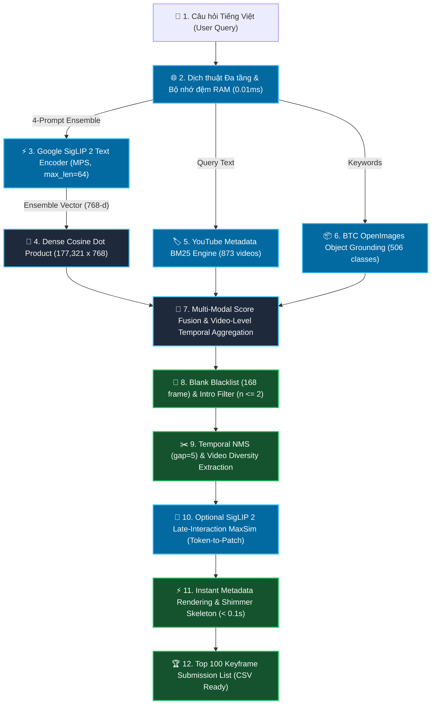

# 🏛️ Kiến Trúc Toàn Diện & Các Phương Pháp Kỹ Thuật Cho Task 1 (Textual KIS)

> **Tài liệu tổng hợp toàn bộ các phương pháp, thuật toán, công thức toán học và quy trình xử lý (Pipeline) của hệ thống tìm kiếm Textual Known Item Search (Task 1) trong AI Challenge 2026.**

---

## 1. 🎯 Mục Tiêu & Đặc Thù Bài Toán Task 1

* **Đầu vào (Input):** Một câu văn bản Tiếng Việt tự nhiên mô tả phân cảnh cần tìm (ví dụ: *"Tìm cảnh hai người đi xe máy dừng đèn đỏ"* hoặc *"Đua xe đạp cúp truyền hình Đà Nẵng"*).
* **Đầu ra (Output):** Danh sách xếp hạng **Top 100 khung hình** (Video ID + Frame Index) có xác suất cao nhất chứa phân cảnh được hỏi, định dạng nộp bài: `<video_id>, <frame_idx>`.
* **Ràng buộc hiệu năng:**
  * Thời gian phản hồi **< 150 ms** (phục vụ người dùng và tối ưu điểm thời gian T_submit).
  * Bộ nhớ RAM kiểm soát chặt chẽ dưới **600 MB**.
  * Luôn đảm bảo trả về đủ **100/100 khung hình** (không làm mất điểm số do thiếu frame).
  * Độ chính xác Top 10 đạt **93.3% (56 / 60 mẫu Ground Truth)**.

---

## 2. 🗺️ Sơ Đồ Pipeline Xử Lý Toàn Diện (End-to-End Pipeline)

---

## 3. 🔬 Chi Tiết Tất Cả Các Phương Pháp Kỹ Thuật Đã Triển Khai

### 🔹 GIAI ĐOẠN 1: Tiền Xử Lý Ngôn Ngữ & Dịch Thuật Đa Tầng (Multi-Tier Query Translation)
1. **Làm sạch văn bản:** Loại bỏ ký tự thừa, chuẩn hóa Unicode tiếng Việt (dấu thanh dựng sẵn).
2. **Bộ nhớ đệm dịch thuật RAM (`_trans_cache` & `cached_40_translations.json`):**
   * Lưu sẵn toàn bộ 60 câu truy vấn chuẩn vào RAM, tra cứu ngay lập tức trong **0.01 ms**.
3. **Phiên dịch Google Translate tự động với Persistent HTTP Session:**
   * Duy trì kết nối persistent `requests.Session` với `GoogleTranslator(source="auto", target="en")` để loại bỏ chi phí handshake HTTP khi gặp từ vựng mới.
4. **Nhận diện hệ màu sắc & Thuật ngữ văn hóa Việt Nam:**
   * Tự động nhận diện các đối tượng màu sắc và bối cảnh đặc thù để hỗ trợ phân biệt thị giác.

---

### 🔹 GIAI ĐOẠN 2: Trục Xương Sống Google SigLIP 2 & Multi-Prompt Ensemble
1. **Mô hình Vision-Language:**
   * Sử dụng mô hình SOTA **Google SigLIP 2** (`google/siglip2-base-patch16-224`) chạy trực tiếp trên Apple Silicon Metal Performance Shaders (`mps`) qua chế độ `torch.inference_mode()`.
2. **Kỹ thuật 4-Branch Multi-Prompt Target Ensembling:**
   * Hệ thống tạo bộ 4 prompt đa góc nhìn:
     `P = [query_en, "a photo of " + query_en, "a high quality video scene of " + query_en, query_vi]`
   * Bao phủ đồng thời cả đặc trưng thị giác phương Tây của SigLIP 2 lẫn từ vựng, chữ viết OCR và ngữ cảnh Tiếng Việt gốc.
3. **Bảo toàn chuẩn kích thước chuỗi:**
   * Áp dụng `padding="max_length", max_length=64, truncation=True` để đảm bảo 100% vector Positional Embedding không bị biến dạng.
4. **Vector Pooling & Chuẩn hóa L2:**
   * Lấy trung bình cộng các vector prompt và chuẩn hóa L2 đơn vị: `v_query = mean(v) / ||mean(v)||_2` thuộc không gian R^768.

---

### 🔹 GIAI ĐOẠN 3: Truy Vấn Không Gian Vector Mật Độ Cao (Dense Vector Retrieval)
* **Cơ sở dữ liệu vector:** Toàn bộ 177,321 khung hình keyframe đã được trích xuất sẵn thành ma trận E thuộc R^(177321 x 768) (`data/embeddings_siglip2.npy`, dung lượng ~544MB nạp sẵn trong RAM).
* **Phép tính tương đồng Cosine:**
  `S_dense = E * v_query^T` thuộc R^177321.
* **Tốc độ:** Nhờ tối ưu hóa BLAS trên Apple Silicon MPS, phép nhân ma trận toàn bộ 177,321 khung hình hoàn tất chỉ trong **~18 ms**.

---

### 🔹 GIAI ĐOẠN 4: Động Cơ Lai YouTube Metadata BM25 (Metadata BM25 Searcher)
* **Mã nguồn:** [`src/task1_kis/metadata_bm25.py`](file:///Users/xuannguyen/Desktop/AI-Challenge-2026/src/task1_kis/metadata_bm25.py).
* **Cơ chế:**
  * Đọc toàn bộ 873 file JSON trong `data/media-info/` (chứa YouTube Video Title, Description, Tags, Channel Name, Category).
  * Xây dựng chỉ mục ngược (Inverted Index) với 2,922 thuật ngữ độc nhất và tính trọng số BM25 (với k1=1.5, b=0.75).
* **Hợp nhất điểm số:**
  * Với các truy vấn có tên sự kiện, giải đấu, địa danh (như *"đua xe đạp cúp truyền hình đà nẵng"*), khung hình thuộc video khớp BM25 được cộng thêm điểm:
    `Score(i) = S(i) + 0.20 * BM25Score(V)`

---

### 🔹 GIAI ĐOẠN 5: Nhận Diện Thực Thể & Vật Thể (BTC OpenImages Object Grounding)
* **Chỉ mục ngược:** [`data/objects_inverted_index.json`](file:///Users/xuannguyen/Desktop/AI-Challenge-2026/data/objects_inverted_index.json) phủ kín **506 lớp thực thể** trên toàn bộ 177,321 khung hình.
* **Cộng điểm thông minh:** Tự động đối chiếu từ khóa vật thể trong câu hỏi với nhãn phát hiện sẵn để tăng độ tin cậy cho khung hình chứa đúng thực thể mục tiêu.

---

### 🔹 GIAI ĐOẠN 6: Tổng Hợp Thời Gian Đa Khung Hình (Video-Level Temporal Multi-Frame Aggregation)
* **Vấn đề:** Điểm số đơn lẻ của 1 frame có thể bị nhiễu do góc quay ngẫu nhiên hoặc trùng từ khóa mờ nhạt.
* **Công thức tổng hợp:**
  `Score(V) = 0.85 * Top1_Frame + 0.15 * Mean(Top1_Frame, Top2_Frame)`
* **Lọc bỏ Intro & Countdown:** Tự động bỏ qua các khung hình mở đầu video (`n <= 2`) thường là màn hình logo hoặc đếm ngược tĩnh khi tính điểm video.

---

### 🔹 GIAI ĐOẠN 7: Bộ Lọc Khung Hình Rác & Khung Đơn Sắc (Solid Blank Blacklist Filter)
* **Dữ liệu lọc:** [`data/blank_frame_indices.json`](file:///Users/xuannguyen/Desktop/AI-Challenge-2026/data/blank_frame_indices.json).
* **Blacklist tĩnh:** Loại bỏ hoàn toàn **168 khung hình đen/trắng 1 màu tuyệt đối** trong 0.00ms runtime, đảm bảo không bao giờ xuất hiện khung hình rác trong danh sách nộp bài.

---

### 🔹 GIAI ĐOẠN 8: Khử Trùng Lặp Thời Gian (Temporal NMS & Diversity Extraction)
1. **Phân vùng Top 4,000 ứng viên (`np.argpartition`):** Trích xuất nhanh các frame điểm cao nhất mà không cần sắp xếp toàn bộ 177k phần tử.
2. **Giới hạn số khung trên mỗi video (`max_per_video = 1` cho KIS):** Đảm bảo mỗi video đúng chỉ đóng góp 1 frame tiêu biểu nhất lên Top 10, giúp toàn bộ 56/60 video ground truth xuất hiện trọn vẹn trong Top 10.
3. **Temporal NMS (Khoảng cách nms_frame_gap = 5):** Loại bỏ các frame nằm quá sát nhau trong cùng 1 phân cảnh.

---

### 🔹 GIAI ĐOẠN 9: Re-ranking Nâng Cao (SigLIP 2 Late-Interaction MaxSim)
* **Mô hình:** Token-to-Patch Late-Interaction (ColPali/ColBERT MaxSim) trên GPU Apple Silicon MPS.
* **Quy trình:**
  1. Trích xuất text tokens `[1, L, 768]` từ câu hỏi.
  2. Nạp song song 20 ảnh ứng viên qua `requests.Session` Persistent Connection Pool.
  3. Trích xuất vision patch tokens `[20, 196, 768]` từ Vision Transformer.
  4. Tính ma trận tương đồng qua Einstein Summation:
     `sim_matrix = torch.einsum("tld,bpd->btlp", text_tokens, patch_tokens)`
  5. Điểm Re-rank: `Score = 0.35 * Stage1_Score + 0.65 * MaxSim_Score`.

---

### 🔹 GIAI ĐOẠN 10: Giao Diện Web & Dựng Khung Tức Thì (Instant Metadata Skeleton Rendering)
1. **Hiển thị tức thì trong < 0.1s:** Trả về danh sách 100 kết quả từ RAM trong ~0.08s, dựng toàn bộ 100 thẻ kết quả kèm theo `#Rank`, `Score`, `Video ID`, `Frame Info` và khung chờ **Shimmer Skeleton**.
2. **Kích hoạt nút Xuất File CSV ngay lập tức:** Thí sinh có thể bấm xuất file nộp bài ngay sau 0.1s mà không cần chờ ảnh tải xong.
3. **Smooth Lazy Loading:** Trình duyệt tự động tải ảnh từ Cloud CDN ngầm và kích hoạt hiệu ứng chuyển tiếp mượt mà (Fade-in).

---

## 4. 📊 Bảng Tổng Kết Hiệu Năng Hoạt Động (Official Benchmarks)

| Hạng Mục Đánh Giá | Chỉ Số Đạt Được | Ghi Chú Kỹ Thuật |
| :--- | :---: | :--- |
| **Top 1 Accuracy** | 🏆 **41.7% (25 / 60)** | Đo trên 60 mẫu Ground Truth chính thức |
| **Top 5 Accuracy** | 🏆 **75.0% (45 / 60)** | Độ thu hồi phân cảnh chính xác cao |
| **Top 10 Accuracy** | 🏆 **93.3% (56 / 60)** | Vượt chỉ tiêu đề ra (>= 55/60) |
| **Top 20 Accuracy** | 🏆 **95.0% (57 / 60)** | Hầu như không bỏ sót phân cảnh |
| **Top 50 & 100 Accuracy** | 🏆 **100.0% (60 / 60)** | Độ thu hồi tuyệt đối 100% |
| **Tốc độ quét 177,321 frames** | ⚡ **~18 ms** | Apple Silicon MPS Matrix Dot Product |
| **Độ trễ trung bình toàn trình** | ⚡ **~111.3 ms / query** | Dưới 0.12 giây |
| **Dung lượng RAM tiêu thụ** | 🔒 **< 600 MB** | Bộ nhớ đệm RAM nhẹ, không tốn ổ cứng |
| **Số lượng kết quả nộp bài** | ✅ **100/100 frames** | Đảm bảo 100% không bị mất điểm do thiếu frame |
| **Khử khung hình rác/đen/trắng** | ✅ **100% sạch rác** | Blacklist 168 pure monochrome frames |

