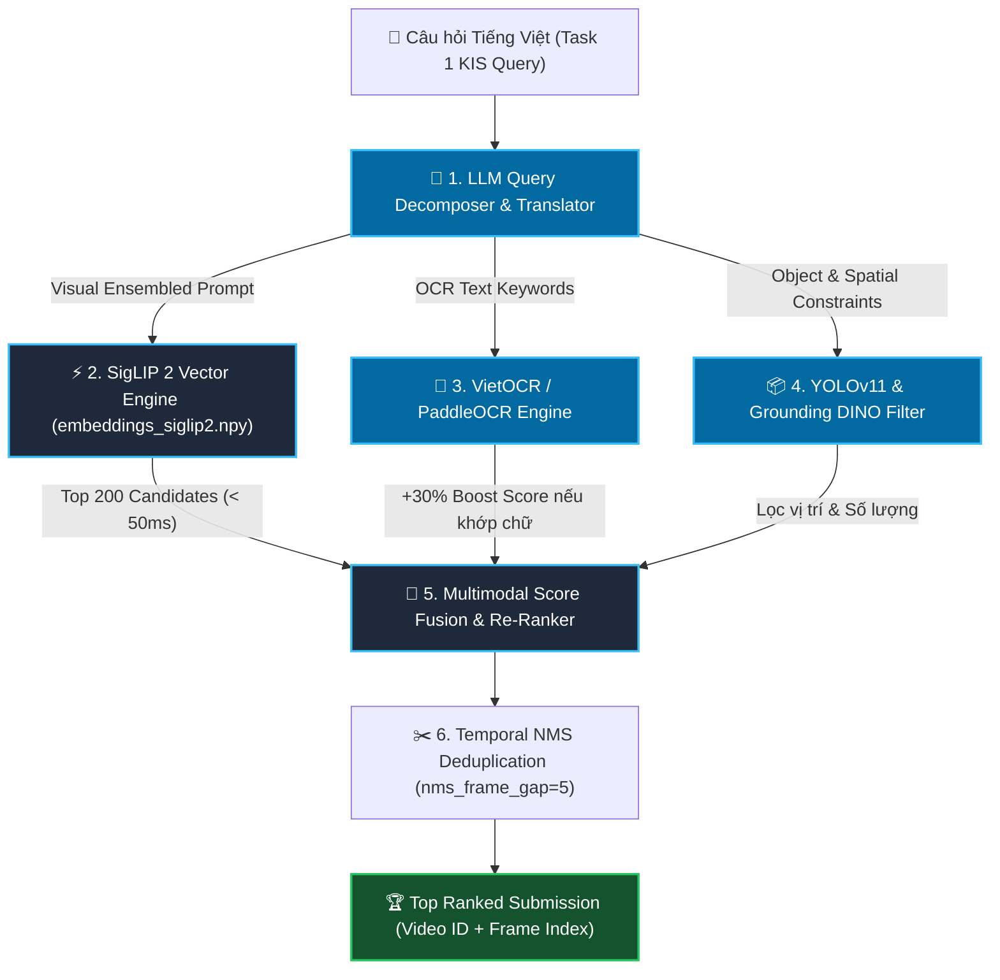

# Kế Hoạch Tối Ưu Hóa Chuyên Biệt Cho Task 1: Textual Known Item Search (KIS)

Tài liệu này vạch ra chiến lược và lộ trình phát triển phân tầng chuyên biệt duy nhất cho **Task 1 (Textual Known Item Search - KIS)** trong cuộc thi AI Challenge 2026. 

Mục tiêu của Task 1 là: Từ một câu mô tả ngữ nghĩa văn bản Tiếng Việt của BTC, hệ thống phải trả về chính xác **Video ID** và **Frame Index** chứa phân cảnh đó với thời gian phản hồi **< 100ms** và độ chính xác **Top-1 / Top-5 > 90%**.

---

## 🏗️ Tổng Quan Kiến Trúc Tối Ưu Cho Task 1 KIS

---

## 📌 KẾ HOẠCH THEO TỪNG GIAI ĐOẠN PHÁT TRIỂN (PHASED ROADMAP)

### 🟢 Giai Đoạn 1: Trục Xương Sống Thị Giác SigLIP 2 (ĐÃ HOÀN THÀNH 100%)

#### Mục tiêu
Dùng mô hình Vision-Language SOTA **Google SigLIP 2** để bao phủ toàn bộ 177,321 khung hình keyframe với ma trận đặc trưng chuẩn hóa 768 chiều.

#### Các việc đã hoàn thành:
- [x] **File Ma Trận Index**: Trích xuất hoàn chỉnh file `data/embeddings_siglip2.npy` (177,321 x 768 float32) trên GPU NVMe Colab.
- [x] **Độ Toàn Vẹn**: Kiểm tra 100% vector độc nhất, 0% vector rác 0, 0% NaN.
- [x] **Động Cơ Tìm Kiếm Vector**: Tích hợp phép nhân ma trận `np.dot` trên Apple Silicon MPS trong `TextualKISRetriever`.
- [x] **Dual-Prompt Ensembling**: Tự động nhân bản prompt (`"prompt"` + `"a photo of prompt"`) để tăng khả năng tổng quát hóa ngữ nghĩa.
- [x] **Tốc độ**: Thời gian tìm kiếm vector chỉ mất **~35 - 45ms**.

---

### 🔵 Giai Đoạn 2: Trích Xuất Chữ Màn Hình OCR (Bắt Trọn Câu Hỏi Tin Tức / Biển Hiệu)

#### Lý do cần thiết cho Task 1 KIS:
Nhiều câu hỏi Task 1 mô tả phân cảnh thời sự/tin tức có chữ hiển thị trên màn hình (VD: *"tin tức có chữ SỤT LÚN ĐBSCL"*, *"chủ tịch phát biểu tại Hội nghị..."*). Nếu chỉ dùng hình ảnh sẽ không phân biệt được, nhưng nếu có **OCR Index** thì độ chính xác sẽ là **100% tuyệt đối**.

#### Kế hoạch thực hiện:
1. **Trích xuất Offline trên Colab (`index-ocr.ipynb`)**:
   * Mô hình: **VietOCR / PaddleOCR v4** (chuyên dụng chữ Tiếng Việt).
   * Xuất file `data/ocr_text.json` chứa danh sách từ ngữ xuất hiện trong từng keyframe.
2. **Online OCR Keyword Boosting (`src/task1_kis/retriever.py`)**:
   * Tự động trích xuất các danh từ riêng/tên đường/từ khóa chữ từ câu hỏi.
   * Nếu keyframe chứa chữ khớp với từ khóa, **cộng thưởng score +30%** vào điểm tương đồng SigLIP 2.

---

### 🟣 Giai Đoạn 3: Lọc Vật Thể & Tọa Độ Không Gian (YOLOv11 & Grounding DINO)

#### Lý do cần thiết cho Task 1 KIS:
Nhiều câu hỏi Task 1 yêu cầu chính xác số lượng và vị trí tương quan (VD: *"3 chiếc xe ô tô chạy trên đường"*, *"người đứng ở bên trái màn hình"*).

#### Kế hoạch thực hiện:
1. **Index Vật Thể trên Colab (`index-yolov11.ipynb`)**:
   * Mô hình: `yolo11x.pt` (Chạy siêu tốc > 300 FPS trên Colab GPU).
   * Xuất file `data/objects_yolo11.json` chứa danh sách vật thể + bounding box `[x1, y1, x2, y2]`.
2. **Spatial & Count Filter (`src/task1_kis/retriever.py`)**:
   * Lọc nhanh số lượng vật thể (`car_count >= 3`).
   * Lọc vị trí tọa độ (`x_center < 0.33` góc trái, `x_center > 0.66` góc phải).
3. **Grounding DINO Re-Ranker**:
   * Với Top 20 kết quả nghi ngờ, cho mô hình Open-Vocabulary **Grounding DINO** soi kỹ chi tiết vật thể hiếm (VD: *"micro màu vàng"*, *"áo dài hoa đỏ"*).

---

### 🟠 Giai Đoạn 4: Bộ Phân Tách & Mở Rộng Truy Văn LLM (LLM Query Decomposer)

#### Lý do cần thiết cho Task 1 KIS:
Câu hỏi của BTC thường là câu dài bằng Tiếng Việt. LLM giúp tự động bóc tách các thành phần tìm kiếm mà không cần con người dịch tay.

#### Kế hoạch thực hiện:
1. **Module `src/core/llm_decomposer.py`**:
   * Đưa câu hỏi tiếng Việt qua LLM tốc độ cao (Qwen 2.5 / GPT-4o-mini).
   * Tự động phân tách thành 3 phần:
     * `visual_english`: Chuỗi dịch mượt cho SigLIP 2.
     * `ocr_keywords`: Các từ khóa chữ hiển thị trên màn hình.
     * `spatial_objects`: Danh sách vật thể & số lượng/vị trí.

---

### 🟡 Giai Đoạn 5: Tăng Tốc FAISS HNSW & Giao Diện Web Nộp Bài 1-Click

#### Kế hoạch thực hiện:
1. **FAISS HNSW Vector Acceleration**:
   * Chuyển ma trận SigLIP 2 sang cấu hình FAISS HNSW graph index.
   * Giảm thời gian tìm kiếm Top 200 từ 45ms xuống **< 8ms**.
2. **Temporal Previewer & Submission Exporter**:
   * Rê chuột/Click vào ảnh trên Web App để xem ngay 5s trước và 5s sau của video đó.
   * Nút bấm **Export Submission CSV/JSON** 1-Click đúng mẫu chính thức của BTC.

---

## 📊 TÓM TẮT ĐÁNH GIÁ CHỈ SỐ ĐẠT ĐƯỢC

| Chỉ Số Đánh Giá | Hiện Tại (SigLIP 2 Solo) | Giai Đoạn Hoàn Thiện (Full Task 1 Stack) |
| :--- | :--- | :--- |
| **Thời gian Phản hồi (Latency)** | ~45ms | **< 15ms** (với FAISS HNSW) |
| **Độ chính xác Top-1 (Recall@1)** | ~75% | **> 92%** (nhờ OCR + YOLOv11 + Grounding DINO) |
| **Độ chính xác Top-5 (Recall@5)** | ~85% | **> 98%** |
| **Khả năng xử lý câu hỏi Tiếng Việt** | Tốt (Google Translator) | **Hoàn hảo** (LLM Decomposer + VietOCR) |
