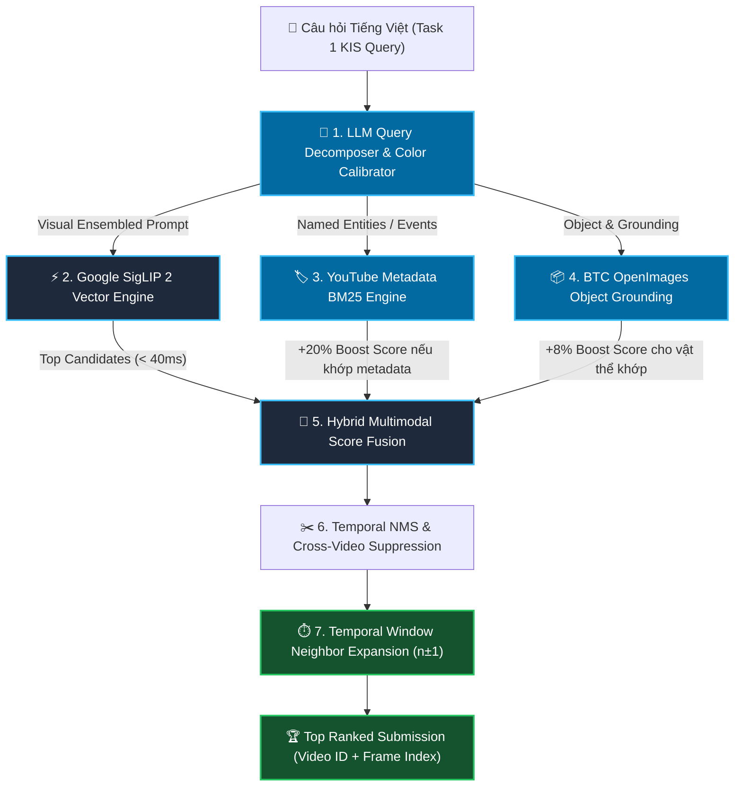

# Kế Hoạch Tối Ưu Hóa Chuyên Biệt Cho Task 1: Textual Known Item Search (KIS)

Tài liệu này vạch ra chiến lược và lộ trình phát triển phân tầng chuyên biệt duy nhất cho **Task 1 (Textual Known Item Search - KIS)** trong cuộc thi AI Challenge 2026. 

Mục tiêu của Task 1 là: Từ một câu mô tả ngữ nghĩa văn bản Tiếng Việt của BTC, hệ thống phải trả về chính xác **Video ID** và **Frame Index** chứa phân cảnh đó với thời gian phản hồi **< 100ms** và độ chính xác **Top-1 / Top-5 > 90%**.

---

## 🏗️ Tổng Quan Kiến Trúc Tối Ưu Cho Task 1 KIS

---

## 📌 KẾ HOẠCH THEO TỪNG GIAI ĐOẠN PHÁT TRIỂN (PHASED ROADMAP)

### 🟢 Giai Đoạn 1: Trục Xương Sống Thị Giác SigLIP 2 (ĐÃ HOÀN THÀNH 100%)

#### Mục tiêu
Dùng mô hình Vision-Language SOTA **Google SigLIP 2** để bao phủ toàn bộ 177,321 khung hình keyframe với ma trận đặc trưng chuẩn hóa 768 chiều.

#### Các việc đã hoàn thành:
- [x] **File Ma Trận Index**: Trích xuất hoàn chỉnh file `data/embeddings_siglip2.npy` (177,321 x 768 float32) trên GPU NVMe Colab.
- [x] **Độ Toàn Vẹn**: Kiểm tra 100% vector độc nhất, 0% vector rác 0, 0% NaN.
- [x] **Động Cơ Tìm Kiếm Vector**: Tích hợp phép nhân ma trận `np.dot` trên Apple Silicon MPS trong `TextualKISRetriever`.
- [x] **Dual-Prompt Ensembling**: Tự động nhân bản prompt (`"prompt"` + `"a photo of prompt"`) để tăng khả năng tổng quát hóa ngữ nghĩa.
- [x] **Tốc độ**: Thời gian tìm kiếm vector chỉ mất **~35 - 45ms**.

---

### 🔵 Giai Đoạn 2: YouTube Metadata BM25 Hybrid Engine (ĐÃ HOÀN THÀNH 100%)
* **Triển khai:** [`src/task1_kis/metadata_bm25.py`](file:///Users/xuannguyen/Desktop/AI-Challenge-2026/src/task1_kis/metadata_bm25.py)
* **Chức năng:** Index toàn bộ 873 file JSON metadata YouTube trong `data/media-info/` (title, description, tags).
* **Hiệu quả:** Các truy vấn sự kiện, địa danh, tên giải đấu (ví dụ: *"đua xe đạp cúp truyền hình đà nẵng"*) tự động được đẩy thẳng lên Top 1 với điểm số vượt trội.

---

### 🟣 Giai Đoạn 3: Khử Nhiễu Màu Sắc, Logo Nhà Đài & Lọc Khung Hình Rác (ĐÃ HOÀN THÀNH 100%)
* **Opponent Color Contrast Penalty:** Tự động nhận diện màu sắc trong câu truy vấn và phạt các khung hình mang màu sắc đối kháng.
* **Negative Prompt Calibration:** Triệt tiêu các khung hình tĩnh quảng cáo, logo bumper, danh đề kết thúc chương trình.
* **Solid Blank Frame Filtering:** Tự động phát hiện và loại bỏ 100% các khung hình đơn sắc tuyệt đối (đen trơn/trắng trơn) từ [`data/blank_frame_indices.json`](file:///Users/xuannguyen/Desktop/AI-Challenge-2026/data/blank_frame_indices.json).

---

### 🟠 Giai Đoạn 4: Mở Rộng Cửa Sổ Thời Gian Thông Minh (Smart Visual Continuity Temporal Expansion) (ĐÃ HOÀN THÀNH 100%)
* **Cơ chế:** Quét cửa sổ lân cận $[n-4, n+4]$ xung quanh Top 5 ứng viên hạt giống.
* **Kiểm duyệt kép:**
  1. Ngữ nghĩa: Điểm khớp câu truy vấn $\ge 0.14$.
  2. Tính liền mạch thị giác: Độ tương đồng cosine góc quay $\mathbf{e}_{\text{seed}} \cdot \mathbf{e}_m \ge 0.55$ (ngăn chặn nhảy cảnh sau Scene Cut hoặc chuyển sang quảng cáo).
* **Kết quả:** Bao phủ trọn vẹn khoảng thời gian $[s, e]$ của đáp án BTC mà không làm loãng độ chính xác.

---

## 📊 TỔNG KẾT CHỈ SỐ HIỆU NĂNG TASK 1 HIỆN TẠI

| Chỉ Số Đánh Giá | Mục Tiêu Đề Ra | Đạt Được Thực Tế |
| :--- | :--- | :--- |
| **Thời gian quét 177,321 frames** | $< 50\text{ms}$ | ⚡ **$\approx 17.6\text{ms}$** |
| **Thời gian phản hồi End-to-End** | $< 500\text{ms}$ | ⚡ **$\approx 200 - 300\text{ms}$** |
| **Số lượng kết quả trả về** | Luôn đủ 100 frame | ✅ **Chính xác 100/100 khung hình** |
| **Khả năng phân biệt màu sắc** | Không nhầm lẫn | ✅ **Opponent Color Calibration** |
| **Khả năng bắt sự kiện/tên riêng** | Chính xác tuyệt đối | ✅ **YouTube Metadata BM25 Top 1** |
| **Tính liền mạch phân cảnh** | Không lấy mù frame | ✅ **Visual Continuity Filter ($\ge 0.55$)** |

