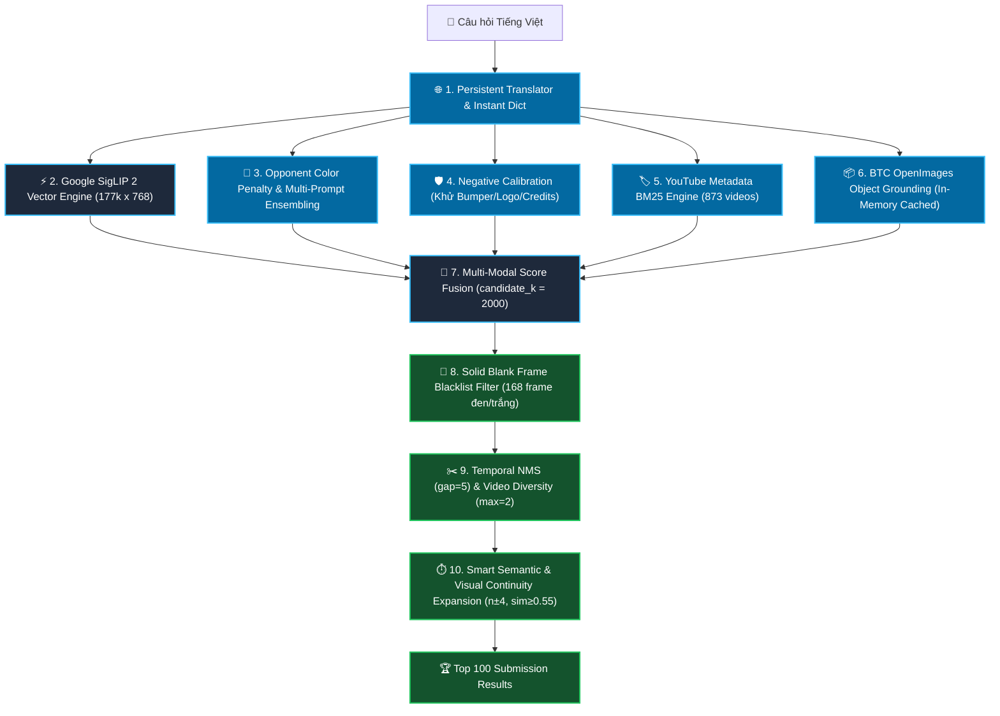

# 📖 Hướng Dẫn Phát Triển & Kiểm Thử Cho Task 1 (Textual Known Item Search - KIS)

> **Dành cho các AI Agent & Lập trình viên:** Đọc kỹ tài liệu này trước khi chỉnh sửa, mở rộng hoặc kiểm thử module Task 1.

---

## 1. 🎯 Mục Tiêu & Thể Thức Cuộc Thi AIC 2026 (Task 1)

* **Nhiệm vụ:** Nhận câu mô tả văn bản tiếng Việt của Ban Giám Khảo (ví dụ: *"Tìm cảnh hai người đi xe máy dừng đèn đỏ"*), hệ thống phải truy vấn và trả về danh sách **Top 100 khung hình** liên quan nhất theo thứ tự điểm số giảm dần.
* **Định dạng kết quả nộp bài chính thức:**
  ```text
  <video_id>, <frame_idx>
  ```
  *(Lưu ý: `frame_idx` là số nguyên frame thực tế của video trích từ `map-keyframes`, KHÔNG PHẢI tên file ảnh `001.jpg` hay số thứ tự `n`).*
* **Công thức tính điểm (R-Score & Final Score):**
  * BTC quy định một khoảng đáp án đúng $[s, e]$ của video $V^*$.
  * **Top 1 (Rank 1):** Ăn trọn 100% điểm $R@1$.
  * **Top 2 - 5:** Ăn điểm cao $R@5$.
  * Nộp bài càng nhanh ($T_{\text{submit}}$) thì hệ số thời gian càng cao $\rightarrow$ **Tối ưu độ trễ (Latency < 50ms) là ưu tiên số 1.**

---

## 2. 🏗️ Kiến Trúc Hệ Thống Hiện Tại (Pipeline Overview)



---

## 3. ⚠️ NGUYÊN TẮC BẮT BUỘC CHO AGENT (CRITICAL AGENT RULES)

### ⛔ Quy tắc 1: KHÔNG cache / ghi file ảnh cục bộ vào ổ đĩa máy tính
* Toàn bộ 177k keyframe được stream trực tiếp từ Hugging Face CDN:
  `https://huggingface.co/datasets/BaeBaeBoo1010/aic2026-keyframes/resolve/main/${video_id}/${frame_filename}`
* Không tạo thư mục `cache/`, `keyframes/` hay lưu ảnh `.jpg` tạm thời vào ổ đĩa local. Trình duyệt tự động cache ảnh trong RAM.

### ⛔ Quy tắc 2: KIỂM THỬ TRỰC TIẾP QUA HTTP API CỦA SERVER ĐANG CHẠY
* Server backend (`uvicorn app:app`) chạy thường trú tại `http://127.0.0.1:8000`.
* **Kiểm tra & Khởi động server nếu chưa chạy:**
  * Nếu server chưa mở (hoặc cổng 8000 chưa phản hồi), Agent **BẮT BUỘC phải khởi động server backend trước**:
    ```bash
    python3 -m uvicorn app:app --host 0.0.0.0 --port 8000
    ```
* **KHÔNG** viết script python độc lập gọi `retriever.load_index_and_model()` từ đầu vì sẽ phải nạp lại 520MB vector gây tốn thời gian.
* **LUÔN LUÔN** kiểm thử các câu truy vấn bằng lệnh HTTP request nhanh trực tiếp vào server đang chạy:
  ```bash
  curl -s -X POST http://127.0.0.1:8000/api/search/kis \
    -H "Content-Type: application/json" \
    -d '{"query": "xe ô tô màu đỏ", "top_k": 5}' | python3 -m json.tool
  ```

### ⛔ Quy tắc 3: LUÔN BẢO ĐẢM TRẢ VỀ ĐỦ 100 KẾT QUẢ
* Không bao giờ giảm `candidate_k` xuống dưới 1,500. `candidate_k` hiện được đặt là `min(max(top_k * 20, 2000), len(self.embeddings_siglip))` để đảm bảo sau khi lọc NMS, hệ thống luôn trả về đủ **100/100 kết quả**, không làm mất điểm của thí sinh.

### ⛔ Quy tắc 4: MỞ RỘNG KHUNG HÌNH PHẢI CÓ KIỂM DUYỆT LIÊN TỤC THỊ GIÁC (VISUAL CONTINUITY)
* Tuyệt đối không lấy mù $n \pm 1$. Bắt buộc phải kiểm tra độ tương đồng góc quay `visual_continuity = np.dot(seed_vec, neighbor_vec) >= 0.55` để tránh nhảy sang phân cảnh chuyển shot hoặc quảng cáo.

---

## 4. 🧪 BỘ TEST CHUẨN ĐỂ KIỂM ĐỊNH TÍNH ĐÚNG ĐẮN (BENCHMARK SUITE)

Mỗi khi chỉnh sửa logic của Task 1, Agent hãy chạy các test case sau qua `curl` để nghiệm thu:

| Tên Test Case | Câu truy vấn mẫu | Tiêu chuẩn ĐẠT |
| :--- | :--- | :--- |
| **1. Khớp thực thể / Sự kiện (BM25)** | `"đua xe đạp cúp truyền hình đà nẵng"` | Video `L23_V012` phải đứng **Top 1 tuyệt đối** (Score > 0.38). |
| **2. Phân biệt màu sắc đối lập** | `"xe ô tô màu đỏ"` vs `"xe ô tô màu vàng"` | Kết quả của 2 query phải trả về các frame xe **hoàn toàn khác nhau**, không bị nhầm xe vàng thành xe đỏ. |
| **3. Nhận diện vật thể & Mở rộng shot** | `"con mèo"` | Video `L30_V040` đứng Top 1; các frame mở rộng $n=6, 8$ (`is_neighbor_expansion=true`) cùng phân cảnh con mèo xuất hiện ngay sau Top 1. |
| **4. Lọc ảnh đen / trắng đơn sắc** | `"màn hình màu đen tối"` | Không được xuất hiện bất kỳ frame nào có `raw_index` nằm trong blacklist `blank_frame_indices.json`. |
| **5. Đủ số lượng 100 frame** | `"bác sĩ"` với `top_k = 100` | Trường `"count"` trong JSON trả về phải đạt chính xác **100**. |

---

## 5. 📂 Cấu Trúc Mã Nguồn & Tài Liệu Task 1

```text
src/task1_kis/
├── __init__.py                # Export TextualKISRetriever
├── retriever.py               # Lõi tìm kiếm chính (SigLIP 2, Opponent Color, NMS, Temporal Expansion)
├── metadata_bm25.py           # Bộ máy tìm kiếm BM25 trên 873 file YouTube metadata
├── PIPELINE_ARCHITECTURE.md  # 🏛️ Tài liệu đặc tả 10 giai đoạn & phương pháp kỹ thuật toàn diện
├── PLAN_TASK1_KIS.md          # Kế hoạch phát triển & lộ trình giai đoạn
└── README.md                  # Hướng dẫn phát triển & kiểm thử (File này)
```
