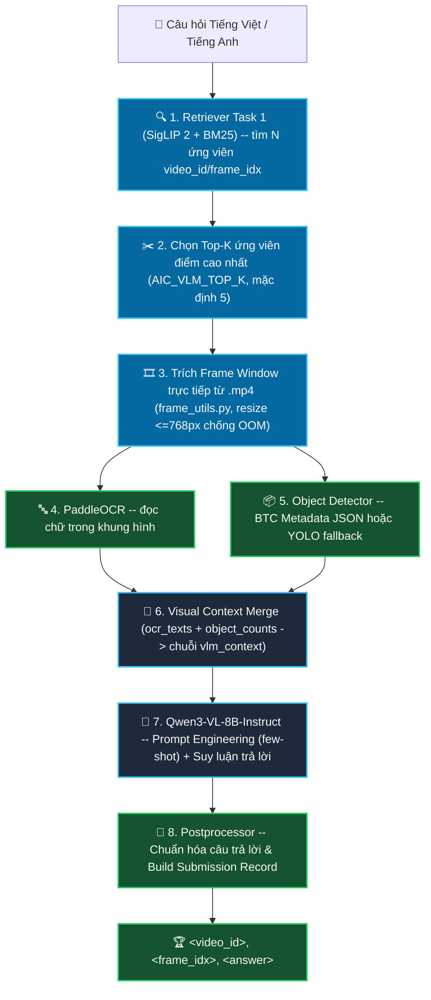

# 📖 Hướng Dẫn Phát Triển & Kiểm Thử Cho Task 2 (Visual Question Answering - VQA)

> **Dành cho các AI Agent & Lập trình viên:** Đọc kỹ tài liệu này trước khi chỉnh sửa, mở rộng hoặc kiểm thử module Task 2.

---

## 1. 🎯 Mục Tiêu & Thể Thức Cuộc Thi AIC 2026 (Task 2)

* **Nhiệm vụ:** Nhận một mô tả sự kiện + một câu hỏi bằng ngôn ngữ tự nhiên (tiếng Việt hoặc
  tiếng Anh) của Ban Giám Khảo (ví dụ: *"Trong video về lễ trao giải âm nhạc, có bao nhiêu
  người lên sân khấu để nhận giải thưởng lớn nhất?"*), hệ thống phải **tự tìm ra đúng khoảnh
  khắc liên quan** trong kho video **và trả lời chính xác câu hỏi** đó.
* **Định dạng kết quả nộp bài chính thức:**
  ```text
  <video_id>, <frame_idx>, <answer>
  ```
* **Công thức tính điểm (R-Score):**
  ```
  R-Score(ri) = I(vi = GTv ∧ idi ∈ [s, e] ∧ ai = GTa)
  ```
  Một kết quả chỉ được tính đúng khi **cả 3 điều kiện cùng đúng**: khớp video, `frame_idx` nằm
  trong khoảng đáp án `[s, e]`, **và** câu trả lời khớp ngữ nghĩa với đáp án của BTC. Sai 1
  trong 3 → toàn bộ dòng đó = 0 điểm. → **Tối ưu cả độ chính xác định vị lẫn độ chính xác câu
  trả lời đều quan trọng như nhau, không được hy sinh cái này để đổi lấy cái kia.**

---

## 2. 🏗️ Kiến Trúc Hệ Thống Hiện Tại (Pipeline Overview)



---

## 3. ⚠️ NGUYÊN TẮC BẮT BUỘC CHO AGENT (CRITICAL AGENT RULES)

### ⛔ Quy tắc 1: KHÔNG load lại model VLM ở mỗi request
* Qwen3-VL-8B mất vài giây + nhiều GB VRAM để tải — chỉ được load **đúng 1 lần lúc server
  khởi động** (đã cấu hình sẵn qua `lifespan` trong `app.py`).
* **KHÔNG** viết script gọi `VisualQAEngine(...).load_models()` lặp lại nhiều lần trong vòng
  lặp test, hoặc mỗi lần chạy 1 câu hỏi lại khởi tạo engine mới.

### ⛔ Quy tắc 2: KIỂM THỬ TRỰC TIẾP QUA HTTP API CỦA SERVER ĐANG CHẠY
* Server backend (`uvicorn app:app`) chạy thường trú tại `http://127.0.0.1:8000`.
* **Kiểm tra & khởi động server nếu chưa chạy:**
  ```bash
  uvicorn app:app --host 0.0.0.0 --port 8000
  ```
* **LUÔN LUÔN** kiểm thử câu hỏi bằng HTTP request trực tiếp vào server đang chạy:
  ```bash
  curl -s -X POST http://127.0.0.1:8000/api/search/vqa \
    -H "Content-Type: application/json" \
    -d '{"question": "Người phụ nữ mặc váy đỏ đang cầm ly màu gì?"}' | python3 -m json.tool
  ```

### ⛔ Quy tắc 3: KHÔNG chạy VLM trên toàn bộ ứng viên retrieval
* Qwen3-VL chậm hơn nhiều lần so với retrieval (vector search). Nếu chạy VLM cho cả
  `top_k=100` ứng viên mỗi câu hỏi sẽ **vượt xa giới hạn thời gian nộp bài**.
* Retriever được phép tìm nhiều ứng viên (`AIC_RETRIEVER_TOP_K`, rẻ/nhanh), nhưng VLM **chỉ**
  chạy trên `AIC_VLM_TOP_K` ứng viên điểm cao nhất (mặc định 5). Không tự ý xóa giới hạn này.

### ⛔ Quy tắc 4: CÂU HỎI VỀ HÀNH ĐỘNG/CHUYỂN ĐỘNG PHẢI DÙNG MULTI-FRAME
* Tuyệt đối không trả lời câu hỏi kiểu "có bao nhiêu người BƯỚC lên sân khấu" chỉ bằng 1 frame
  tĩnh. Bắt buộc dùng `extract_frame_window()` (mặc định `window=2, step=5` → 5 frame liên
  tiếp) để mô hình quan sát được chuyển động, không chỉ trạng thái tại 1 thời điểm.

### ⛔ Quy tắc 5: LUÔN DỌN BỘ NHỚ GPU SAU MỖI LẦN SUY LUẬN
* Mỗi lần gọi `QwenVLMEngine.answer()` phải giải phóng tensor tạm (`gc.collect()` +
  `torch.cuda.empty_cache()`) — không tắt/bỏ bước này, nếu không bộ nhớ GPU sẽ cộng dồn qua
  nhiều câu hỏi liên tiếp và gây `CUDA out of memory` dù mỗi lần gọi riêng lẻ không nặng.

---

## 4. 🧪 BỘ TEST CHUẨN ĐỂ KIỂM ĐỊNH TÍNH ĐÚNG ĐẮN (BENCHMARK SUITE)

Mỗi khi chỉnh sửa logic của Task 2, Agent hãy chạy các test case sau qua `curl` để nghiệm thu:

| Tên Test Case | Câu hỏi mẫu | Tiêu chuẩn ĐẠT |
| :--- | :--- | :--- |
| **1. Đếm số lượng chính xác** | `"Có bao nhiêu người trong cảnh trao giải?"` | `answer` phải là số Ả Rập thuần (`"3"`), không kèm chữ giải thích, không lệch quá 1 đơn vị so với object_counts từ YOLO/metadata (nếu có). |
| **2. Đọc chữ / OCR grounding** | `"Biển hiệu trong ảnh ghi chữ gì?"` | `answer` phải khớp (hoặc là tập con của) `ocr_texts` trả về từ `visual_context.py` cho đúng frame đó. |
| **3. Trả lời ngắn gọn đúng format** | `"Người phụ nữ mặc váy đỏ đang cầm ly màu gì?"` | `answer` không chứa tiền tố thừa (`"Trả lời:"`, `"Answer:"`), không có dấu ngoặc kép bọc ngoài, không có dấu chấm cuối câu — đúng output của `clean_answer()`. |
| **4. Câu hỏi cần ngữ cảnh chuyển động** | `"Người đàn ông đứng dậy mấy lần trong đoạn này?"` | Hệ thống phải gọi `extract_frame_window()` (nhiều frame), không phải `extract_frame()` (1 frame tĩnh). |
| **5. Đúng ngôn ngữ câu hỏi** | Hỏi bằng tiếng Anh: `"What color is the car?"` | `answer` trả về bằng tiếng Anh, không lẫn tiếng Việt. |
| **6. Giới hạn số ứng viên chạy VLM** | Bất kỳ câu hỏi nào với `AIC_RETRIEVER_TOP_K=50` | Số lần gọi `QwenVLMEngine.answer()` không được vượt quá `AIC_VLM_TOP_K` (mặc định 5), dù retriever trả về 50 ứng viên. |
| **7. Không sập khi thiếu video** | `video_id` không tồn tại trong `AIC_VIDEO_DIR` | Server trả lỗi HTTP rõ ràng (không crash toàn bộ process), ứng viên lỗi bị bỏ qua, các ứng viên còn lại vẫn được trả về bình thường. |

---

## 5. 📂 Cấu Trúc Mã Nguồn & Tài Liệu Task 2

```text
src/task2_vqa/
├── __init__.py            # (TV3) Export các class/hàm dùng chung của package
├── object_detector.py     # (TV3) Nhận diện vật thể -- đọc metadata BTC có sẵn, hoặc YOLO khi cần
├── ocr_engine.py           # (TV3) Đọc chữ trong ảnh (PaddleOCR)
├── visual_context.py       # (TV3) Gộp OCR + object detection thành context cho VLM
├── postprocessor.py        # (TV3) Chuẩn hóa câu trả lời + đóng gói đúng format nộp bài
├── test_member3.py         # (TV3) Unit test cho các module OCR/Object Detection
├── config.py                # (TV2) Hằng số dùng chung (model id, đường dẫn, top_k...)
├── frame_utils.py           # (TV2) Trích frame trực tiếp từ file video .mp4
├── qwen_vlm_engine.py        # (TV2) Model VLM (Qwen3-VL-8B) -- prompt engineering + suy luận
├── vqa_engine.py             # (TV2 + TV3) File điều phối chính -- nối retriever + context + VLM
├── app.py                    # (TV2) API /api/search/vqa dùng để BGK/hệ thống chấm điểm gọi vào
├── requirements.txt          # (TV2) Danh sách thư viện cần cài
└── README.md                 # Hướng dẫn phát triển & kiểm thử (File này)
```
